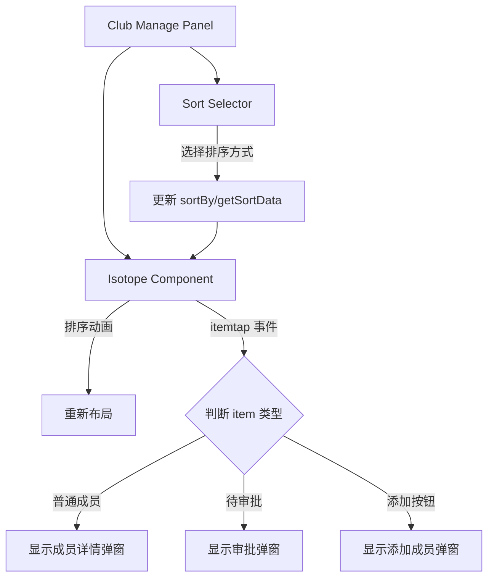
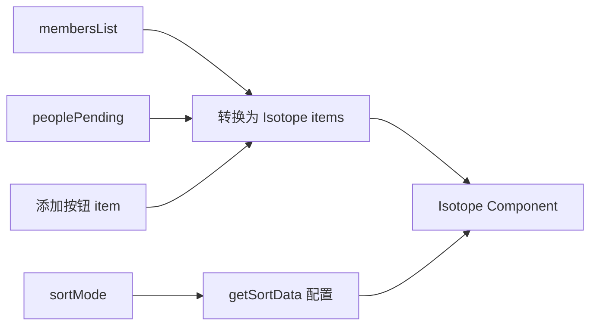

# Design Document: Club Member Isotope Sorting

## Overview

将 club-manage-panel 组件中的人员管理区域改造为使用 Isotope 组件显示会员头像，并添加排序功能。主要改动包括：
1. 扩展 Isotope 组件支持在图片下方显示标签（姓名）
2. 重构 club-manage-panel 的人员管理区域使用 Isotope
3. 添加排序条件选择器，支持多种排序方式

## Architecture

### 组件交互流程



### 数据流



## Components and Interfaces

### Isotope 组件扩展

#### 新增 Properties

```javascript
properties: {
  // 是否显示标签（姓名）
  showLabel: {
    type: Boolean,
    value: false
  },
  // 标签样式配置
  labelStyle: {
    type: Object,
    value: {}
    // 支持的属性：
    // fontSize: 字体大小，如 '22rpx'
    // color: 字体颜色，如 '#333'
    // maxWidth: 最大宽度，如 '96rpx'
    // marginTop: 上边距，如 '6rpx'
  },
  // 标签高度（用于布局计算）
  labelHeight: {
    type: Number,
    value: 32 // rpx
  }
}
```

#### 修改 WXML 模板

```xml
<view class="isotope-item-wrapper" ...>
  <!-- 现有图片内容 -->
  <t-image ... />
  
  <!-- 新增：标签显示 -->
  <view wx:if="{{showLabel && item.label}}" 
        class="isotope-item-label"
        style="{{labelStyleStr}}">
    {{item.label}}
  </view>
</view>
```

#### 修改布局计算

在 `layoutItemsFitRows` 和 `layoutItemsMasonryHorizontal` 方法中，当 `showLabel` 为 true 时，item 高度需要加上 `labelHeight`。

### Club Manage Panel 改造

#### 新增 Data

```javascript
data: {
  // 排序模式
  memberSortMode: 'roleFirst', // 'roleFirst' | 'joinDate' | 'name'
  // 排序选项
  sortOptions: [
    { value: 'roleFirst', label: '会长在前' },
    { value: 'joinDate', label: '入会日期' },
    { value: 'name', label: '姓名字母' }
  ],
  // Isotope items（包含成员、待审批、添加按钮）
  memberIsotopeItems: [],
  // Isotope 排序配置
  memberSortBy: ['_sortPriority', 'join_date'],
  memberGetSortData: {
    _sortPriority: (item) => item._sortPriority || 999,
    join_date: (item) => item.join_date ? new Date(item.join_date).getTime() : 0,
    user_name: (item) => item.user_name || ''
  }
}
```

#### Item 数据结构

```javascript
// 普通成员 item
{
  id: 'member-{user_id}',
  image: '{avatar_url}',
  ini_width: 72,
  ini_height: 72,
  label: '{user_name}',
  // 排序字段
  user_name: '{user_name}',
  join_date: '{join_date}',
  role: '{role}',
  _sortPriority: 0-3, // 0=president, 1=vice_president, 2=director, 3=member
  _isAddButton: false,
  _isPending: false,
  // 原始数据引用
  _memberData: { ... }
}

// 待审批 item
{
  id: 'pending-{applicationID}',
  image: '{avatar_url}',
  ini_width: 72,
  ini_height: 72,
  label: '{user_name}',
  _sortPriority: 0.5, // 在会长之后，其他成员之前
  _isAddButton: false,
  _isPending: true,
  _applicationData: { ... }
}

// 添加按钮 item
{
  id: 'add-member-button',
  image: '', // 不使用图片
  ini_width: 72,
  ini_height: 72,
  label: '添加',
  _sortPriority: 9999, // 始终在最后
  _isAddButton: true,
  _isPending: false
}
```

#### 排序逻辑

```javascript
// 会长在前排序
getSortData: {
  _sortPriority: (item) => {
    if (item._isAddButton) return 9999;
    if (item._isPending) return 0.5;
    const roleOrder = { president: 0, vice_president: 1, director: 2, member: 3 };
    return roleOrder[item.role] ?? 3;
  },
  join_date: (item) => item.join_date ? new Date(item.join_date).getTime() : 0
}
sortBy: ['_sortPriority', 'join_date']

// 入会日期排序
getSortData: {
  _sortPriority: (item) => {
    if (item._isAddButton) return 9999;
    if (item._isPending) return 9998; // 待审批在添加按钮之前
    return 0;
  },
  join_date: (item) => item.join_date ? new Date(item.join_date).getTime() : 0
}
sortBy: ['_sortPriority', 'join_date']

// 姓名字母排序
getSortData: {
  _sortPriority: (item) => {
    if (item._isAddButton) return 9999;
    if (item._isPending) return 9998;
    return 0;
  },
  user_name: (item) => item.user_name || ''
}
sortBy: ['_sortPriority', 'user_name']
```

### WXML 结构

```xml
<!-- 人员管理面板 -->
<view class="panel panel-people">
  <view class="panel-header">
    <view class="panel-title">
      <t-icon name="usergroup" color="var(--md-sys-color-primary)" />
      <text>人员管理</text>
    </view>
    <text class="panel-hint">{{membersList.length}} 人</text>
  </view>
  
  <!-- 排序选择器 -->
  <view class="member-sort-bar">
    <view 
      wx:for="{{sortOptions}}" 
      wx:key="value"
      class="sort-option {{memberSortMode === item.value ? 'active' : ''}}"
      bindtap="onMemberSortChange"
      data-value="{{item.value}}"
    >
      {{item.label}}
    </view>
  </view>
  
  <!-- Isotope 成员网格 -->
  <isotope
    id="memberIsotope"
    items="{{memberIsotopeItems}}"
    layoutMode="fitRows"
    width="660rpx"
    height="{{memberIsoHeight}}"
    gutter="{{14}}"
    autoHeight="{{true}}"
    showLabel="{{true}}"
    labelStyle="{{memberLabelStyle}}"
    labelHeight="{{32}}"
    imageStyle="{{memberImageStyle}}"
    sortBy="{{memberSortBy}}"
    getSortData="{{memberGetSortData}}"
    useCustomSlot="{{true}}"
    bind:itemtap="onMemberItemTap"
    bind:heightChange="onMemberIsoHeightChange"
  >
    <!-- 自定义 slot 用于渲染特殊 item -->
  </isotope>
</view>
```

## Data Models

### Member Item 转换函数

```javascript
/**
 * 将成员数据转换为 Isotope item
 * @param {Object} member - 成员数据
 * @returns {Object} Isotope item
 */
function memberToIsotopeItem(member) {
  const roleOrder = { president: 0, vice_president: 1, director: 2, member: 3 };
  return {
    id: `member-${member.user_id}`,
    image: member.avatar || '/assets/images/default-avatar.png',
    ini_width: 72,
    ini_height: 72,
    label: member.user_name,
    user_name: member.user_name,
    join_date: member.join_date,
    role: member.role,
    _sortPriority: roleOrder[member.role] ?? 3,
    _isAddButton: false,
    _isPending: false,
    _memberData: member
  };
}

/**
 * 将待审批数据转换为 Isotope item
 * @param {Object} application - 待审批数据
 * @returns {Object} Isotope item
 */
function pendingToIsotopeItem(application) {
  return {
    id: `pending-${application.applicationID}`,
    image: application.avatar || '/assets/images/default-avatar.png',
    ini_width: 72,
    ini_height: 72,
    label: application.user_name,
    user_name: application.user_name,
    _sortPriority: 0.5,
    _isAddButton: false,
    _isPending: true,
    _applicationData: application
  };
}

/**
 * 创建添加按钮 item
 * @returns {Object} Isotope item
 */
function createAddButtonItem() {
  return {
    id: 'add-member-button',
    image: '',
    ini_width: 72,
    ini_height: 72,
    label: '添加',
    _sortPriority: 9999,
    _isAddButton: true,
    _isPending: false
  };
}
```

## Correctness Properties

*A property is a characteristic or behavior that should hold true across all valid executions of a system-essentially, a formal statement about what the system should do. Properties serve as the bridge between human-readable specifications and machine-verifiable correctness guarantees.*

### Property 1: Label rendering with showLabel enabled

*For any* Isotope component with `showLabel` set to true and items containing `label` fields, the rendered output SHALL include label elements for each item, and the item layout height SHALL include the label height.

**Validates: Requirements 1.1, 1.2, 1.5**

### Property 2: Add button position invariant

*For any* sort operation applied to the member Isotope grid, the add member button item SHALL always be positioned at the end of the sorted array (highest index).

**Validates: Requirements 3.2, 5.3**

### Property 3: Role-based sorting correctness

*For any* set of members with different roles, when sorted by "会长在前" mode, the resulting order SHALL satisfy:
- All presidents appear before vice_presidents
- All vice_presidents appear before directors
- All directors appear before regular members
- Members with the same role are sorted by join_date ascending

**Validates: Requirements 5.1, 5.2**

### Property 4: Pending member sorting position

*For any* set of members including pending applications:
- In "会长在前" mode: pending members appear after president but before other roles
- In "入会日期" or "姓名字母" mode: pending members appear at the end (before add button)

**Validates: Requirements 6.4, 6.5**

## Error Handling

| 场景 | 处理方式 |
|------|---------|
| 成员头像加载失败 | 显示默认头像 |
| 成员姓名为空 | 显示空字符串或默认文本 |
| join_date 为 null | 使用 0 作为排序值（排在最前） |
| 排序过程中数据变化 | 使用 Isotope 的 isSorting 标志防止冲突 |
| 点击事件无法识别 item 类型 | 检查 _isAddButton 和 _isPending 标志 |

## Testing Strategy

### 单元测试

1. **memberToIsotopeItem 转换测试**
   - 验证所有字段正确映射
   - 验证角色优先级计算正确

2. **pendingToIsotopeItem 转换测试**
   - 验证待审批标志设置正确
   - 验证排序优先级为 0.5

3. **排序配置测试**
   - 验证三种排序模式的 getSortData 配置正确

### Property-Based Tests

使用 fast-check 进行属性测试：

1. **Property 1: Label rendering**
   - 生成随机 items 数组
   - 验证 showLabel 时布局高度包含 labelHeight

2. **Property 2: Add button position**
   - 生成随机成员数组
   - 应用各种排序
   - 验证添加按钮始终在最后

3. **Property 3: Role-based sorting**
   - 生成随机角色的成员
   - 验证排序结果符合角色优先级

4. **Property 4: Pending member position**
   - 生成包含待审批的成员数组
   - 验证不同排序模式下待审批位置正确

### 集成测试

1. 点击成员头像显示详情弹窗
2. 点击待审批头像显示审批弹窗
3. 点击添加按钮显示添加成员弹窗
4. 切换排序模式动画效果
5. 动态添加/删除成员动画效果

