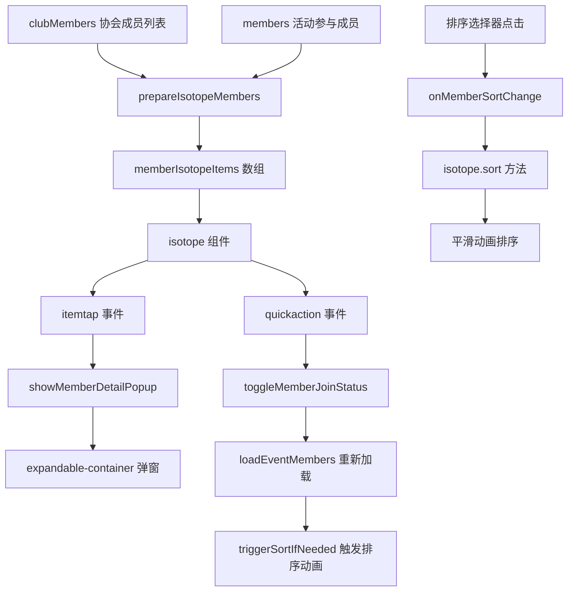

# Design Document: Event Member Grid to Isotope

## Overview

本设计文档描述如何将 event-manage-panel 组件中活动人员弹窗（card-members）内的成员列表从 t-grid 组件改为 isotope 组件，实现排序切换时的平滑动画效果。

**核心目标**：
1. 替换 t-grid 为 isotope 组件，实现排序动画
2. 保留所有现有功能：快速操作按钮（+/-）、成员详情弹窗、状态指示
3. 使用共享弹窗方案（参考 club-manage-panel）
4. 成员加入/退出活动后，触发平滑的排序动画

**参考实现**：club-manage-panel 已成功使用 isotope 组件，本方案完全复制其实现方式。

## Architecture

### 组件关系

```
event-manage-panel
├── expandable-container_fullscreen (card-members 活动人员弹窗)
│   ├── 排序选择器 (member-sort-bar)
│   └── isotope (eventMemberIsotope)
│       └── 成员头像项（带快速操作按钮 +/-）
└── expandable-container (em-shared-member-detail 共享成员详情弹窗)
    └── 成员详情内容（根据 is_joined 状态显示不同内容）
```

### 数据流



### 职责划分

**Isotope 组件**：
- 渲染成员头像网格布局
- 渲染快速操作按钮（根据传入的 `quickActionBtn` 配置）
- 触发事件：`itemtap`（点击成员）、`quickaction`（点击快速按钮）
- 提供 `sort()` 方法实现排序动画
- **不负责**：业务逻辑判断、数据获取、状态管理

**Event-manage-panel 组件**：
- 定义快速操作按钮配置映射（`quickActionConfig`）
- 根据成员 `is_joined` 状态选择按钮配置
- 处理成员加入/退出活动的业务逻辑
- 管理共享弹窗的显示和数据
- 调用 isotope 的 `sort()` 方法触发排序动画
- **负责**：所有业务逻辑、数据交互、状态管理

## Components and Interfaces

### 1. Isotope 组件扩展（添加快速操作按钮渲染）

Isotope 组件需要扩展以支持渲染快速操作按钮，但**不负责按钮的业务逻辑判断**，只负责渲染 event-manage-panel 传入的按钮配置。

#### 1.1 Isotope WXML 修改

在 `components/isotope/index.wxml` 的图片区域内添加快速操作按钮：

```xml
<!-- 在图片区域内添加快速操作按钮 -->
<view class="isotope-item-image" style="...">
  <t-image ... />
  
  <!-- 快速操作按钮：直接渲染 item.quickActionBtn 配置 -->
  <view 
    wx:if="{{item.quickActionBtn}}" 
    class="isotope-quick-btn {{item.quickActionBtn.className}}"
    catchtap="onQuickActionTap"
    data-item="{{item}}"
  >
    <t-icon 
      name="{{item.quickActionBtn.icon}}" 
      size="{{item.quickActionBtn.size || 18}}" 
      color="{{item.quickActionBtn.color || '#fff'}}" 
    />
  </view>
</view>
```

**关键点**：
- `wx:if="{{item.quickActionBtn}}"` - 只有当 item 包含 quickActionBtn 配置时才渲染
- `class="isotope-quick-btn {{item.quickActionBtn.className}}"` - 使用配置中的 className
- `name="{{item.quickActionBtn.icon}}"` - 使用配置中的 icon 名称
- Isotope 不判断 `is_joined`，只渲染传入的配置

#### 1.2 Isotope WXSS 添加样式

在 `components/isotope/index.wxss` 中添加按钮样式：

```css
/* 快速操作按钮基础样式 */
.isotope-quick-btn {
  position: absolute;
  top: 0;
  right: 0;
  width: 44rpx;
  height: 44rpx;
  border-radius: 50%;
  display: flex;
  align-items: center;
  justify-content: center;
  box-shadow: 0 6rpx 16rpx rgba(0,0,0,.18);
  border: 3rpx solid #ffffff;
  z-index: 10;
}

/* 加号按钮（绿色） */
.isotope-quick-btn.plus {
  background: #52c41a;
}

/* 减号按钮（红色） */
.isotope-quick-btn.minus {
  background: #ff4d4f;
}
```

#### 1.3 Isotope JS 添加事件处理

在 `components/isotope/index.js` 中添加事件处理方法：

```javascript
methods: {
  // ... 现有方法
  
  /**
   * 快速操作按钮点击事件
   * 触发 quickaction 事件，将 item 数据传递给父组件
   */
  onQuickActionTap(e) {
    const { item } = e.currentTarget.dataset;
    this.triggerEvent('quickaction', { item });
  }
}
```

**说明**：Isotope 只负责触发事件，不处理任何业务逻辑。

### 2. Event-manage-panel 数据配置

#### 2.1 Data 定义

```javascript
data: {
  // 快速操作按钮配置映射
  quickActionConfig: {
    'joined': {
      icon: 'remove',      // 减号图标
      className: 'minus',  // 红色样式
      color: '#fff',
      size: 18
    },
    'not_joined': {
      icon: 'add',         // 加号图标
      className: 'plus',   // 绿色样式
      color: '#fff',
      size: 18
    }
  },
  
  // Isotope 数据
  memberIsotopeItems: [],      // 传递给 isotope 的成员数组
  memberIsoHeight: '300rpx',   // Isotope 容器高度
  
  // 排序配置
  memberSortMode: 'roleFirst', // 当前排序模式
  memberSortBy: ['_sortPriority', 'join_date'],  // 排序字段
  memberSortAscending: [true, true],             // 排序方向
  sortOptions: [
    { value: 'roleFirst', label: '会长在前' },
    { value: 'joinDate', label: '参加时间' },
    { value: 'name', label: '姓名字母' }
  ],
  
  // 样式配置
  memberImageStyle: {
    borderRadius: '50%',
    border: '2rpx solid #fff',
    boxShadow: '0 2rpx 8rpx rgba(0,0,0,0.1)'
  },
  memberLabelStyle: {
    fontSize: '22rpx',
    color: '#333',
    textAlign: 'center'
  },
  
  // 共享弹窗
  currentMember: null,         // 当前选中的成员（用于共享弹窗）
  
  // 保留原有数据
  members: [],                 // 活动参与成员（从后台获取）
  clubMembers: [],             // 协会成员（从后台获取）
}
```

#### 2.2 WXML 结构

```xml
<!-- 活动人员弹窗 -->
<expandable-container_fullscreen id="card-members" ...>
  <view slot="content" class="card-content">
    <!-- 排序选择器 -->
    <view class="member-sort-bar">
      <view 
        wx:for="{{sortOptions}}" 
        wx:key="value"
        class="sort-option {{memberSortMode === item.value ? 'active' : ''}}"
        bindtap="onMemberSortChange"
        data-mode="{{item.value}}"
      >{{item.label}}</view>
    </view>
    
    <!-- Isotope 成员网格 -->
    <isotope
      id="eventMemberIsotope"
      items="{{memberIsotopeItems}}"
      layoutMode="fitRows"
      width="700rpx"
      height="{{memberIsoHeight}}"
      gutter="{{12}}"
      transitionDuration="0.3s"
      backgroundColor="transparent"
      imageStyle="{{memberImageStyle}}"
      showLabel="{{true}}"
      labelStyle="{{memberLabelStyle}}"
      labelHeight="{{32}}"
      autoHeight="{{true}}"
      sortBy="{{memberSortBy}}"
      sortAscending="{{memberSortAscending}}"
      bind:heightChange="onIsoHeightChange"
      bind:layoutReady="onMemberIsotopeReady"
      bind:itemtap="onMemberItemTap"
      bind:quickaction="onMemberQuickAction"
    />
  </view>
</expandable-container_fullscreen>

<!-- 共享成员详情弹窗 -->
<expandable-container
  id="em-shared-member-detail"
  expanded-width="700"
  expanded-height="900"
  bg-color="#f2f3f5"
  bind:collapse="onSharedMemberPopupCollapse"
>
  <view slot="trigger" style="display: none;"></view>
  <view slot="content" class="popup-shell" wx:if="{{currentMember}}">
    <!-- 弹窗内容：根据 is_joined 状态显示不同内容 -->
    <view class="popup-header">
      <view class="popup-title">成员信息</view>
    </view>
    <view class="popup-body">
      <!-- 成员头像和基本信息 -->
      <view class="member-expanded-header">
        <image class="member-avatar-large" src="{{currentMember.avatar}}" mode="aspectFill" />
        <view class="member-expanded-info">
          <view class="member-expanded-name-row">
            <text class="member-expanded-name">{{currentMember.user_name}}</text>
            <view class="role-badge-large member-role-{{currentMember.role}}">{{currentMember.role_display}}</view>
          </view>
          <view class="member-expanded-meta">
            <view class="detail-item" wx:if="{{currentMember.department}}">
              <t-icon name="location" size="16" color="#666" />
              <text>{{currentMember.department}}</text>
            </view>
            <view class="detail-item" wx:if="{{currentMember.position}}">
              <t-icon name="user" size="16" color="#666" />
              <text>{{currentMember.position}}</text>
            </view>
          </view>
        </view>
      </view>

      <!-- 详细信息 -->
      <view class="member-expanded-details">
        <view class="member-detail-row" wx:if="{{currentMember.phone}}">
          <text class="detail-label">联系电话</text>
          <text class="detail-value">{{currentMember.phone}}</text>
        </view>
        <view class="member-detail-row">
          <text class="detail-label">参加状态</text>
          <text class="detail-value">{{currentMember.is_joined ? '已参加' : '未参加'}}</text>
        </view>
        <!-- 只有已参加的成员才显示打卡状态 -->
        <view class="member-detail-row" wx:if="{{currentMember.is_joined}}">
          <text class="detail-label">打卡状态</text>
          <text class="detail-value">{{currentMember.is_clockin ? '已打卡' : '未打卡'}}</text>
        </view>
      </view>
    </view>
    
    <!-- 底部操作按钮 -->
    <view class="popup-footer">
      <!-- 未参加：显示"加入活动"按钮 -->
      <t-button
        wx:if="{{!currentMember.is_joined}}"
        theme="primary"
        block
        bindtap="addMemberFromCard"
        data-user-id="{{currentMember.user_id}}"
      >把ta加入活动</t-button>
      
      <!-- 已参加：显示"退出活动"按钮 -->
      <t-button
        wx:else
        theme="danger"
        block
        bindtap="removeMemberFromCard"
        data-user-id="{{currentMember.user_id}}"
        data-user-name="{{currentMember.user_name}}"
      >把ta退出活动</t-button>
    </view>
  </view>
</expandable-container>
```

**关键点**：
- `items="{{memberIsotopeItems}}"` - 传入包含 quickActionBtn 配置的成员数据
- `bind:itemtap="onMemberItemTap"` - 监听成员点击事件
- `bind:quickaction="onMemberQuickAction"` - 监听快速操作按钮点击事件
- 共享弹窗根据 `currentMember.is_joined` 状态显示不同内容
#### 2.3 JS 方法实现

##### 2.3.1 构建成员数据（修改现有的 `prepareIsotopeMembers`）

```javascript
/**
 * 构建成员 Isotope 数据
 * 修改现有方法，添加 quickActionBtn 配置
 */
prepareIsotopeMembers() {
  const { clubMembers, members, quickActionConfig } = this.data;
  const eventMemberMap = new Map((members || []).map((m) => [String(m.user_id), m]));
  const roleNames = { 'president': '会长', 'vice_president': '副会长', 'director': '理事', 'member': '会员' };
  const rolePriority = { 'president': 0, 'vice_president': 1, 'director': 2, 'member': 3 };

  const isotopeItems = (clubMembers || []).map(member => {
    const eventMember = eventMemberMap.get(String(member.user_id));
    const isJoined = !!eventMember;
    const isClockin = !!(eventMember && eventMember.clockin_date);
    const status = isClockin ? 'clockin' : (isJoined ? 'joined' : 'not');
    const joinDate = eventMember ? (eventMember.join_date || '') : '';
    
    // 根据状态选择按钮配置
    const buttonStatus = isJoined ? 'joined' : 'not_joined';
    const quickActionBtn = quickActionConfig[buttonStatus];
    
    return {
      id: `member-${member.user_id}`,
      image: member.avatar || '/assets/images/default-avatar.png',
      ini_width: 72,
      ini_height: 72,
      label: member.user_name,
      user_id: member.user_id,
      user_name: member.user_name,
      phone: member.phone,
      department: member.department,
      position: member.position,
      avatar: member.avatar,
      role: member.role,
      role_display: roleNames[member.role] || member.role_display || '会员',
      is_joined: isJoined,
      is_clockin: isClockin,
      status,
      join_date: joinDate,
      quickActionBtn: quickActionBtn,  // ✅ 添加快速操作按钮配置
      _sortPriority: rolePriority[member.role] !== undefined ? rolePriority[member.role] : 3,
    };
  });
  
  // 改用 memberIsotopeItems 而不是 isotopeMembers
  this.setData({ memberIsotopeItems: isotopeItems });
  // 不再调用 sortIsotopeMembers()，由 isotope 内部处理
}
```

##### 2.3.2 排序模式切换（修改现有的 `onMemberSortChange`）

```javascript
/**
 * 成员排序模式切换
 * 修改现有方法，调用 isotope 的 sort() 方法
 */
onMemberSortChange(e) {
  const mode = e.currentTarget.dataset.mode || e.detail?.value;
  if (!mode || mode === this.data.memberSortMode) return;
  
  let sortBy, sortAscending;
  switch (mode) {
    case 'roleFirst':
      sortBy = ['_sortPriority', 'join_date'];
      sortAscending = [true, true];
      break;
    case 'joinDate':
      sortBy = ['join_date'];
      sortAscending = [true];
      break;
    case 'name':
      sortBy = ['user_name'];
      sortAscending = [true];
      break;
  }
  
  this.setData({ 
    memberSortMode: mode, 
    memberSortBy: sortBy, 
    memberSortAscending: sortAscending 
  }, () => {
    const iso = this.selectComponent('#eventMemberIsotope');
    if (iso && iso.sort) {
      iso.sort(sortBy, sortAscending);
    }
  });
}
```

##### 2.3.3 成员点击事件（新增方法）

```javascript
/**
 * 成员点击事件
 * 显示成员详情弹窗
 */
onMemberItemTap(e) {
  const { item, tapX, tapY } = e.detail;
  if (!item) return;
  this.showMemberDetailPopup(item, tapX, tapY);
}

/**
 * 显示成员详情弹窗
 */
showMemberDetailPopup(item, tapX, tapY) {
  // 构建弹窗数据，包含活动相关状态
  const memberData = {
    user_id: item.user_id,
    user_name: item.user_name,
    phone: item.phone,
    department: item.department,
    position: item.position,
    avatar: item.avatar,
    role: item.role,
    role_display: item.role_display,
    is_joined: item.is_joined,      // 是否参加活动
    is_clockin: item.is_clockin     // 是否已打卡
  };
  
  this.setData({ currentMember: memberData }, () => {
    setTimeout(() => {
      const popup = this.selectComponent('#em-shared-member-detail');
      if (popup && popup.expand) {
        popup.expand(tapX, tapY);
      }
    }, 50);
  });
}

/**
 * 弹窗收起时清空数据
 */
onSharedMemberPopupCollapse() {
  setTimeout(() => {
    this.setData({ currentMember: null });
  }, 600);
}
```

##### 2.3.4 快速操作按钮点击（新增方法）

```javascript
/**
 * 处理快速操作按钮点击
 * 接收 isotope 触发的 quickaction 事件
 */
onMemberQuickAction(e) {
  const { item } = e.detail;
  if (!item) return;
  
  // 调用统一的成员状态切换方法
  this.toggleMemberJoinStatus(item.user_id, item.user_name, item.is_joined, false);
}
```

##### 2.3.5 统一的成员状态切换方法（新增方法）

```javascript
/**
 * 统一的成员状态切换方法
 * @param {string} userId - 用户 ID
 * @param {string} userName - 用户名称
 * @param {boolean} isJoined - 当前是否已参加
 * @param {boolean} fromPopup - 是否来自弹窗操作
 */
async toggleMemberJoinStatus(userId, userName, isJoined, fromPopup = false) {
  try {
    wx.showLoading({ title: isJoined ? '退出中...' : '加入中...' });
    
    if (isJoined) {
      // 退出活动
      const res = await this.request({ 
        url: `/event/${this.data.eventId}/remove/${userId}`, 
        method: 'GET' 
      });
      
      if (String(res.Flag) !== '4000') {
        throw new Error(res.message || '退出失败');
      }
    } else {
      // 加入活动
      const res = await this.request({ 
        url: `/event/${this.data.eventId}/addmember/${userId}`, 
        method: 'GET' 
      });
      
      if (String(res.Flag) !== '4000' || !res.message?.includes('成功')) {
        throw new Error(res.message || '加入失败');
      }
    }
    
    // 重新加载成员数据（获取最新的 join_date）
    await this.loadEventMembers(this.data.eventId);
    
    wx.hideLoading();
    wx.showToast({
      title: isJoined ? '已退出活动' : '已加入活动',
      icon: 'success'
    });
    
    // 如果来自弹窗，先收起弹窗，再触发排序动画
    if (fromPopup) {
      const popup = this.selectComponent('#em-shared-member-detail');
      if (popup && popup.collapse) {
        popup.collapse();
      }
      
      // 等待弹窗收起动画完成（600ms）后再触发排序
      setTimeout(() => {
        this.triggerSortIfNeeded();
      }, 600);
    } else {
      // 快捷按钮操作，立即触发排序
      this.triggerSortIfNeeded();
    }
    
    // 触发更新事件（通知父组件）
    this.triggerEvent('update', { event: this.data.event });
    
  } catch (e) {
    wx.hideLoading();
    console.error(e);
    wx.showToast({
      title: e.message || '操作失败',
      icon: 'none'
    });
  }
}

/**
 * 根据当前排序模式触发排序动画
 */
triggerSortIfNeeded() {
  const { memberSortMode, memberSortBy, memberSortAscending } = this.data;
  
  // 只在"参加时间"排序模式下触发排序动画
  // 其他模式（会长在前、姓名字母）不需要重新排序，因为角色和姓名没有变化
  if (memberSortMode === 'joinDate') {
    const iso = this.selectComponent('#eventMemberIsotope');
    if (iso && iso.sort) {
      iso.sort(memberSortBy, memberSortAscending);
    }
  }
}
```

##### 2.3.6 修改现有的弹窗操作方法

```javascript
/**
 * 从弹窗中添加成员到活动
 * 修改现有方法，调用统一的切换方法
 */
async addMemberFromCard(e) {
  const userId = e.currentTarget.dataset.userId;
  const member = this.data.currentMember;
  if (!member) return;
  
  // 调用统一的成员状态切换方法，标记来自弹窗
  this.toggleMemberJoinStatus(userId, member.user_name, false, true);
}

/**
 * 从弹窗中移除成员
 * 修改现有方法，调用统一的切换方法
 */
async removeMemberFromCard(e) {
  const userId = e.currentTarget.dataset.userId;
  const userName = e.currentTarget.dataset.userName;
  
  const ok = await wx.showModal({
    title: '确认退出',
    content: `确定让 "${userName}" 退出活动吗？`,
    confirmText: '退出',
    confirmColor: '#ff4d4f',
    cancelText: '取消',
  });
  
  if (!ok.confirm) return;
  
  // 调用统一的成员状态切换方法，标记来自弹窗
  this.toggleMemberJoinStatus(userId, userName, true, true);
}
```

##### 2.3.7 Isotope 事件处理（新增方法）

```javascript
/**
 * Isotope 高度变化事件
 */
onIsoHeightChange(e) {
  const { heightStr } = e.detail;
  this.setData({ memberIsoHeight: heightStr });
}

/**
 * Isotope 布局就绪事件
 */
onMemberIsotopeReady(e) {
  console.log('Member isotope layout ready:', e.detail);
}
```
### 3. 成员数据结构

```javascript
// memberIsotopeItems 数组中每个成员的数据结构
{
  id: `member-${user_id}`,         // 唯一标识
  image: avatar,                   // 头像 URL
  ini_width: 72,                   // 头像宽度
  ini_height: 72,                  // 头像高度
  label: user_name,                // 显示的姓名
  user_id: String,                 // 用户 ID
  user_name: String,               // 用户姓名
  phone: String,                   // 联系电话
  department: String,              // 部门
  position: String,                // 职位
  avatar: String,                  // 头像 URL
  role: String,                    // 角色 (president/vice_president/director/member)
  role_display: String,            // 角色显示名称
  // 活动状态
  is_joined: Boolean,              // 是否已参加活动
  is_clockin: Boolean,             // 是否已打卡
  status: String,                  // 状态 (clockin/joined/not)
  join_date: String,               // 参加活动时间（ISO 格式）
  // 快速操作按钮配置（由 event-manage-panel 定义）
  quickActionBtn: {
    icon: String,                  // 图标名称 ('add' | 'remove')
    className: String,             // 样式类名 ('plus' | 'minus')
    color: String,                 // 图标颜色（默认 '#fff'）
    size: Number                   // 图标大小（默认 18）
  },
  // 排序字段
  _sortPriority: Number            // 排序优先级（用于"会长在前"排序）
}
```

## Data Models

### 状态数据变更

需要在 event-manage-panel 的 data 中添加以下属性：

```javascript
data: {
  // 新增：成员 Isotope 相关
  memberIsotopeItems: [],          // Isotope 使用的成员数组
  memberIsoHeight: '300rpx',       // Isotope 容器高度
  memberSortMode: 'roleFirst',     // 当前排序模式
  memberSortBy: ['_sortPriority', 'join_date'],  // 排序字段
  memberSortAscending: [true, true],             // 排序方向
  sortOptions: [
    { value: 'roleFirst', label: '会长在前' },
    { value: 'joinDate', label: '参加时间' },
    { value: 'name', label: '姓名字母' }
  ],
  memberLabelStyle: {
    fontSize: '22rpx',
    color: '#333',
    textAlign: 'center'
  },
  memberImageStyle: { borderRadius: '50%' },
  currentMember: null,             // 当前选中的成员（用于共享弹窗）
  
  // 保留原有数据
  members: [],                     // 活动参与成员
  clubMembers: [],                 // 协会成员
  // 删除：sortedIsotopeMembers（不再需要，由 isotope 内部管理）
}
```

## Isotope 排序动画机制确认

基于对 isotope 组件源码的分析，确认排序动画机制如下：

### ✅ 动画工作原理

1. **sort() 方法调用流程**：
   ```javascript
   // 外部调用
   iso.sort(['join_date'], [true])
   
   // 内部执行
   sortItems(sortBy, sortAscending) {
     // 1. 复制数组并排序
     const sortedItems = [...currentItems].sort((a, b) => compareItems(a, b, sortBy, sortAscending))
     
     // 2. 更新 index 属性
     for (let i = 0; i < sortedItems.length; i++) {
       sortedItems[i].index = i
     }
     
     // 3. 更新数据
     this.setData({ itemsWithPosition: sortedItems }, () => {
       // 4. 重新布局（重新计算 x, y 坐标）
       this.resetLayout()
       this.layoutItems()
     })
   }
   ```

2. **动画触发机制**：
   - `layoutItems()` 重新计算每个 item 的 `x`, `y` 坐标
   - WXML 中每个 item 的 `style` 包含 `transition: all 0.3s`
   - 当 `item.x` 或 `item.y` 改变时，CSS transition 自动触发平滑动画
   - **关键**：`item.id` 保持不变（如 `member-${user_id}`），所以 WXML 能正确追踪元素并应用动画

3. **为什么动画有效**：
   - ✅ `wx:key="id"` 确保元素身份稳定
   - ✅ `item.id` 在排序前后保持不变
   - ✅ 只有 `item.x` 和 `item.y` 改变
   - ✅ CSS `transition: all 0.3s` 自动应用到位置变化
   - ✅ 结果：成员头像从当前位置平滑移动到新位置

### ✅ 数据更新策略确认

**最终方案：使用 `loadEventMembers()` + 手动触发 `sort()`**

```javascript
async toggleMemberJoinStatus(userId, userName, isJoined, fromPopup = false) {
  try {
    // 1. 调用 API（加入或退出活动）
    if (isJoined) {
      await this.request({ url: `/event/${this.data.eventId}/remove/${userId}`, method: 'GET' })
    } else {
      await this.request({ url: `/event/${this.data.eventId}/addmember/${userId}`, method: 'GET' })
    }
    
    // 2. 重新加载成员数据（获取最新的 join_date）
    await this.loadEventMembers(this.data.eventId)
    
    // 3. 如果来自弹窗，先收起弹窗，再触发排序动画
    if (fromPopup) {
      const popup = this.selectComponent('#em-shared-member-detail')
      if (popup && popup.collapse) {
        popup.collapse()
      }
      
      // 等待弹窗收起动画完成（600ms）后再触发排序
      setTimeout(() => {
        this.triggerSortIfNeeded()
      }, 600)
    } else {
      // 快捷按钮操作，立即触发排序
      this.triggerSortIfNeeded()
    }
    
  } catch (e) {
    // 错误处理
  }
}

triggerSortIfNeeded() {
  const { memberSortMode, memberSortBy, memberSortAscending } = this.data
  
  // 只在"参加时间"排序模式下触发排序动画
  if (memberSortMode === 'joinDate') {
    const iso = this.selectComponent('#eventMemberIsotope')
    if (iso && iso.sort) {
      iso.sort(memberSortBy, memberSortAscending)
    }
  }
}
```

**为什么这个方案有效**：

1. **`loadEventMembers()` 的作用**：
   ```javascript
   async loadEventMembers(eventId) {
     const res = await this.request({ url: `/event/${eventId}/members`, method: 'GET' })
     if (res.Flag == 4000) {
       const members = res.data.members || []
       const membersClockinCount = members.filter((m) => !!m.clockin_date).length
       this.setData({ members, membersClockinCount, selectedMemberIds: [] })
       this.prepareIsotopeMembers()
       return
     }
     throw new Error(res.message || '获取成员失败')
   }
   ```
   
   **后台返回的数据结构**（来自 `event.py` 的 `/event/<event_id>/members` 接口）：
   ```python
   {
     'Flag': '4000',
     'message': '调用成功',
     'data': {
       'members': [
         {
           'member_id': ej.joinID,
           'user_id': user.userID,
           'user_name': user.userName,
           'phone': user.phone,
           'department': user.department,
           'position': user.position,
           'avatar': user.avatar.fileUrl,
           'join_date': ej.joinDate.isoformat(),  # ✅ 包含准确的加入时间
           'clockin_date': ej.clockinDate.isoformat(),
           'is_current_user': user.userID == cur_user.userID
         }
       ]
     }
   }
   ```
   
   **关键点**：
   - ✅ 重新请求后台获取最新的 `members` 数组（只包含已参加活动的成员）
   - ✅ 包含准确的 `join_date`（后台数据库中的 `EventJoin.joinDate` 字段）
   - ✅ 包含 `clockin_date`（打卡时间）
   - ✅ 调用 `prepareIsotopeMembers()` 重新构建 `memberIsotopeItems`
   - ✅ **不会触发 sort**，只是更新数据
   - ⚠️ **注意**：`members` 数组只包含已参加活动的成员，不包含未参加的协会成员

2. **`prepareIsotopeMembers()` 的作用**：
   ```javascript
   prepareIsotopeMembers() {
     const { clubMembers, members } = this.data
     const eventMemberMap = new Map((members || []).map((m) => [String(m.user_id), m]))
     
     const isotopeItems = (clubMembers || []).map(member => {
       const eventMember = eventMemberMap.get(String(member.user_id))
       const isJoined = !!eventMember
       const isClockin = !!(eventMember && eventMember.clockin_date)
       const status = isClockin ? 'clockin' : (isJoined ? 'joined' : 'not')
       const joinDate = eventMember ? (eventMember.join_date || '') : ''  // ✅ 使用后台返回的 join_date
       
       return {
         id: `member-${member.user_id}`,
         // ... 其他字段
         is_joined: isJoined,
         is_clockin: isClockin,
         status,
         join_date: joinDate,  // ✅ 准确的加入时间
         _sortPriority: rolePriority[member.role] || 3
       }
     })
     
     this.setData({ isotopeMembers: isotopeItems }, () => {
       this.sortIsotopeMembers()
     })
   }
   ```
   
   **关键点**：
   - 遍历 `clubMembers`（所有协会成员）
   - 通过 `eventMemberMap` 查找每个成员是否在 `members`（活动参与成员）中
   - 如果找到，使用后台返回的 `join_date`
   - 如果没找到，`join_date` 为空字符串（未参加）
   - 构建完整的 `isotopeItems` 数组（包含所有协会成员，标记参加状态）

3. **手动调用 `iso.sort()` 的作用**：
   - 对 `memberIsotopeItems` 数组重新排序
   - 重新计算每个 item 的 `x`, `y` 坐标
   - **触发 CSS transition 动画**
   - 用户看到成员头像从当前位置平滑移动到新位置

3. **为什么不会导致其他成员重新渲染**：
   - `loadEventMembers()` 只更新数据，不触发布局变化
   - 只有调用 `iso.sort()` 时才重新计算位置
   - 其他成员的 `item.id` 保持不变，WXML 不会重新创建元素
   - 只是位置（`x`, `y`）改变，触发平滑动画

4. **时序控制**：
   - **弹窗操作**：API → loadEventMembers → popup.collapse() → 等待 600ms → triggerSortIfNeeded()
   - **快捷按钮操作**：API → loadEventMembers → triggerSortIfNeeded()
   - 确保弹窗先从原位置收起，然后成员位置才移动

## 实施可行性分析

基于对 event-manage-panel 当前代码的分析，以下是实施方案的可行性评估：

### ✅ 可以直接对接的部分

1. **数据准备方法已存在**：
   - `prepareIsotopeMembers()` 方法已经存在，构建了 `isotopeMembers` 数组
   - 包含所有需要的字段：`is_joined`, `is_clockin`, `status`, `join_date`, `_sortPriority`
   - **只需添加 `quickActionBtn` 配置即可**

2. **排序功能已实现**：
   - `sortIsotopeMembers()` 方法已存在
   - `onMemberSortChange()` 事件处理已存在
   - 三种排序模式（roleFirst, joinDate, name）已完整实现
   - **可以直接复用，只需改为调用 isotope 的 sort() 方法**

3. **成员操作方法已完整**：
   - `toggleMemberJoinFast()` - 快速切换成员参加状态 ✅
   - `addMemberFromCard()` - 从弹窗添加成员 ✅
   - `removeMemberFromCard()` - 从弹窗移除成员 ✅
   - `directAddUserToEvent()` - 添加成员到活动 ✅
   - `removeMembers()` - 移除成员 ✅
   - **这些方法可以直接使用，无需修改**

4. **数据状态已定义**：
   - `memberSortMode`, `sortOptions` 已存在
   - `memberImageStyle`, `memberLabelStyle` 已存在
   - `currentMember` 已存在（用于共享弹窗）
   - **只需添加 `memberIsotopeItems`, `memberSortBy`, `memberSortAscending`, `quickActionConfig`**

### ⚠️ 需要修改的部分

1. **prepareIsotopeMembers() 方法**：
   ```javascript
   // 当前代码：
   this.setData({ isotopeMembers: isotopeItems }, () => {
     this.sortIsotopeMembers();
   });
   
   // 需要改为：
   this.setData({ memberIsotopeItems: isotopeItems });
   // 不再需要 sortIsotopeMembers()，由 isotope 内部处理
   ```
   
   **修改点**：
   - 添加 `quickActionBtn` 配置到每个 item
   - 改用 `memberIsotopeItems` 而不是 `isotopeMembers`
   - 移除 `sortIsotopeMembers()` 调用

2. **onMemberSortChange() 方法**：
   ```javascript
   // 当前代码：
   this.setData({ memberSortMode: mode }, () => {
     this.sortIsotopeMembers();
   });
   
   // 需要改为：
   this.setData({ 
     memberSortMode: mode, 
     memberSortBy: sortBy, 
     memberSortAscending: sortAscending 
   }, () => {
     const iso = this.selectComponent('#eventMemberIsotope');
     if (iso && iso.sort) {
       iso.sort(sortBy, sortAscending);
     }
   });
   ```
   
   **修改点**：
   - 计算 `sortBy` 和 `sortAscending` 数组
   - 调用 isotope 的 `sort()` 方法而不是本地排序

3. **WXML 结构**：
   ```xml
   <!-- 当前使用 t-grid -->
   <t-grid column="{{5}}" ...>
     <t-grid-item wx:for="{{sortedIsotopeMembers}}" ...>
       <expandable-container ...>
   
   <!-- 需要改为 isotope -->
   <isotope
     id="eventMemberIsotope"
     items="{{memberIsotopeItems}}"
     bind:itemtap="onMemberItemTap"
     bind:quickaction="onMemberQuickAction"
     ...
   />
   
   <!-- 添加共享弹窗 -->
   <expandable-container id="em-shared-member-detail" ...>
   ```
   
   **修改点**：
   - 替换 t-grid 为 isotope 组件
   - 移除每个成员的独立 expandable-container
   - 添加共享的 expandable-container 弹窗
   - 移除快速操作按钮的 WXML（由 isotope 渲染）

4. **新增方法**：
   ```javascript
   // 需要添加这些方法：
   onMemberItemTap(e) { ... }           // 处理成员点击
   showMemberDetailPopup(item, tapX, tapY) { ... }  // 显示弹窗
   onSharedMemberPopupCollapse() { ... } // 弹窗收起
   onMemberQuickAction(e) { ... }       // 处理快速操作按钮
   onIsoHeightChange(e) { ... }         // 处理高度变化
   onMemberIsotopeReady() { ... }       // Isotope 准备完成
   ```

### 🚨 容易出错的地方

1. **数据字段名称不一致**：
   - 当前使用 `isotopeMembers` 和 `sortedIsotopeMembers`
   - 设计方案使用 `memberIsotopeItems`
   - **风险**：可能遗漏某些地方的字段名更新
   - **解决**：全局搜索替换，确保所有引用都更新

2. **快速操作按钮的数据传递**：
   - 当前 t-grid 中直接使用 `data-is-joined="{{item.is_joined}}"`
   - 新方案中 isotope 通过 `item.quickActionBtn` 渲染
   - **风险**：`onMemberQuickAction` 需要从 `e.detail.item` 获取数据
   - **解决**：确保 `quickActionBtn` 配置正确添加到每个 item

3. **弹窗数据同步**：
   - 当前每个成员有独立的 expandable-container
   - 新方案使用共享弹窗，需要设置 `currentMember`
   - **风险**：弹窗收起时需要延迟清空数据（等待动画完成）
   - **解决**：使用 `setTimeout(() => { this.setData({ currentMember: null }) }, 600)`

4. **排序逻辑迁移**：
   - 当前使用 `sortIsotopeMembers()` 在 JS 中排序
   - 新方案使用 isotope 的 `sort()` 方法
   - **风险**：排序字段映射可能不一致
   - **解决**：
     - `roleFirst`: `sortBy: ['_sortPriority', 'join_date']`
     - `joinDate`: `sortBy: ['join_date']`
     - `name`: `sortBy: ['user_name']`

5. **成员数据更新后的刷新**：
   - 当前调用 `this.sortIsotopeMembers()` 重新排序
   - 新方案需要调用 `this.buildMemberIsotopeItems()` 重新构建数据
   - **风险**：添加/移除成员后，isotope 可能不会自动更新
   - **解决**：在 `directAddUserToEvent()` 和 `removeMembers()` 后调用 `buildMemberIsotopeItems()`

6. **Isotope 组件的 ID 选择器**：
   - 需要使用 `this.selectComponent('#eventMemberIsotope')`
   - **风险**：ID 拼写错误或选择器失败
   - **解决**：确保 WXML 中 isotope 的 id 与 JS 中的选择器一致

### 📋 实施步骤

#### 第一步：修改 Isotope 组件（添加快速操作按钮支持）

1. **修改 `components/isotope/index.wxml`**：
   - 在图片区域内添加快速操作按钮渲染代码
   - 使用 `wx:if="{{item.quickActionBtn}}"` 条件渲染

2. **修改 `components/isotope/index.wxss`**：
   - 添加 `.isotope-quick-btn` 基础样式
   - 添加 `.isotope-quick-btn.plus` 绿色样式
   - 添加 `.isotope-quick-btn.minus` 红色样式

3. **修改 `components/isotope/index.js`**：
   - 添加 `onQuickActionTap(e)` 方法
   - 触发 `quickaction` 事件

#### 第二步：修改 Event-manage-panel Data 定义

在 `components/event-manage-panel/index.js` 的 `data` 中添加：

```javascript
data: {
  // 新增：快速操作按钮配置
  quickActionConfig: {
    'joined': { icon: 'remove', className: 'minus', color: '#fff', size: 18 },
    'not_joined': { icon: 'add', className: 'plus', color: '#fff', size: 18 }
  },
  
  // 新增：Isotope 数据（替换 isotopeMembers）
  memberIsotopeItems: [],
  
  // 新增：排序字段数组
  memberSortBy: ['_sortPriority', 'join_date'],
  memberSortAscending: [true, true],
  
  // 保留现有字段
  memberSortMode: 'roleFirst',
  sortOptions: [...],
  memberIsoHeight: '300rpx',
  memberImageStyle: {...},
  memberLabelStyle: {...},
  currentMember: null,
  members: [],
  clubMembers: [],
  // 删除：isotopeMembers, sortedIsotopeMembers（不再需要）
}
```

#### 第三步：修改 prepareIsotopeMembers() 方法

```javascript
prepareIsotopeMembers() {
  const { clubMembers, members, quickActionConfig } = this.data;
  const eventMemberMap = new Map((members || []).map((m) => [String(m.user_id), m]));
  const roleNames = { 'president': '会长', 'vice_president': '副会长', 'director': '理事', 'member': '会员' };
  const rolePriority = { 'president': 0, 'vice_president': 1, 'director': 2, 'member': 3 };

  const isotopeItems = (clubMembers || []).map(member => {
    const eventMember = eventMemberMap.get(String(member.user_id));
    const isJoined = !!eventMember;
    const isClockin = !!(eventMember && eventMember.clockin_date);
    const status = isClockin ? 'clockin' : (isJoined ? 'joined' : 'not');
    const joinDate = eventMember ? (eventMember.join_date || '') : '';
    
    // ✅ 添加：根据状态选择按钮配置
    const buttonStatus = isJoined ? 'joined' : 'not_joined';
    const quickActionBtn = quickActionConfig[buttonStatus];
    
    return {
      id: `member-${member.user_id}`,
      image: member.avatar || '/assets/images/default-avatar.png',
      ini_width: 72,
      ini_height: 72,
      label: member.user_name,
      user_id: member.user_id,
      user_name: member.user_name,
      phone: member.phone,
      department: member.department,
      position: member.position,
      avatar: member.avatar,
      role: member.role,
      role_display: roleNames[member.role] || member.role_display || '会员',
      is_joined: isJoined,
      is_clockin: isClockin,
      status,
      join_date: joinDate,
      quickActionBtn: quickActionBtn,  // ✅ 添加
      _sortPriority: rolePriority[member.role] !== undefined ? rolePriority[member.role] : 3,
    };
  });
  
  // ✅ 修改：改用 memberIsotopeItems
  this.setData({ memberIsotopeItems: isotopeItems });
  // ✅ 删除：不再调用 sortIsotopeMembers()
}
```

#### 第四步：修改 onMemberSortChange() 方法

```javascript
onMemberSortChange(e) {
  const mode = e.currentTarget.dataset.mode || e.detail?.value;
  if (!mode || mode === this.data.memberSortMode) return;
  
  // ✅ 添加：计算 sortBy 和 sortAscending 数组
  let sortBy, sortAscending;
  switch (mode) {
    case 'roleFirst':
      sortBy = ['_sortPriority', 'join_date'];
      sortAscending = [true, true];
      break;
    case 'joinDate':
      sortBy = ['join_date'];
      sortAscending = [true];
      break;
    case 'name':
      sortBy = ['user_name'];
      sortAscending = [true];
      break;
  }
  
  // ✅ 修改：更新 sortBy 和 sortAscending，调用 isotope.sort()
  this.setData({ 
    memberSortMode: mode, 
    memberSortBy: sortBy, 
    memberSortAscending: sortAscending 
  }, () => {
    const iso = this.selectComponent('#eventMemberIsotope');
    if (iso && iso.sort) {
      iso.sort(sortBy, sortAscending);
    }
  });
  
  // ✅ 删除：不再调用 sortIsotopeMembers()
}
```

#### 第五步：添加新方法

在 `components/event-manage-panel/index.js` 的 `methods` 中添加：

```javascript
methods: {
  // ... 现有方法
  
  // ✅ 新增：成员点击事件
  onMemberItemTap(e) {
    const { item, tapX, tapY } = e.detail;
    if (!item) return;
    this.showMemberDetailPopup(item, tapX, tapY);
  },
  
  // ✅ 新增：显示成员详情弹窗
  showMemberDetailPopup(item, tapX, tapY) {
    const memberData = {
      user_id: item.user_id,
      user_name: item.user_name,
      phone: item.phone,
      department: item.department,
      position: item.position,
      avatar: item.avatar,
      role: item.role,
      role_display: item.role_display,
      is_joined: item.is_joined,
      is_clockin: item.is_clockin
    };
    
    this.setData({ currentMember: memberData }, () => {
      setTimeout(() => {
        const popup = this.selectComponent('#em-shared-member-detail');
        if (popup && popup.expand) {
          popup.expand(tapX, tapY);
        }
      }, 50);
    });
  },
  
  // ✅ 新增：弹窗收起时清空数据
  onSharedMemberPopupCollapse() {
    setTimeout(() => {
      this.setData({ currentMember: null });
    }, 600);
  },
  
  // ✅ 新增：快速操作按钮点击
  onMemberQuickAction(e) {
    const { item } = e.detail;
    if (!item) return;
    this.toggleMemberJoinStatus(item.user_id, item.user_name, item.is_joined, false);
  },
  
  // ✅ 新增：统一的成员状态切换方法
  async toggleMemberJoinStatus(userId, userName, isJoined, fromPopup = false) {
    try {
      wx.showLoading({ title: isJoined ? '退出中...' : '加入中...' });
      
      if (isJoined) {
        const res = await this.request({ 
          url: `/event/${this.data.eventId}/remove/${userId}`, 
          method: 'GET' 
        });
        if (String(res.Flag) !== '4000') {
          throw new Error(res.message || '退出失败');
        }
      } else {
        const res = await this.request({ 
          url: `/event/${this.data.eventId}/addmember/${userId}`, 
          method: 'GET' 
        });
        if (String(res.Flag) !== '4000' || !res.message?.includes('成功')) {
          throw new Error(res.message || '加入失败');
        }
      }
      
      await this.loadEventMembers(this.data.eventId);
      
      wx.hideLoading();
      wx.showToast({
        title: isJoined ? '已退出活动' : '已加入活动',
        icon: 'success'
      });
      
      if (fromPopup) {
        const popup = this.selectComponent('#em-shared-member-detail');
        if (popup && popup.collapse) {
          popup.collapse();
        }
        setTimeout(() => {
          this.triggerSortIfNeeded();
        }, 600);
      } else {
        this.triggerSortIfNeeded();
      }
      
      this.triggerEvent('update', { event: this.data.event });
      
    } catch (e) {
      wx.hideLoading();
      console.error(e);
      wx.showToast({
        title: e.message || '操作失败',
        icon: 'none'
      });
    }
  },
  
  // ✅ 新增：根据排序模式触发排序动画
  triggerSortIfNeeded() {
    const { memberSortMode, memberSortBy, memberSortAscending } = this.data;
    if (memberSortMode === 'joinDate') {
      const iso = this.selectComponent('#eventMemberIsotope');
      if (iso && iso.sort) {
        iso.sort(memberSortBy, memberSortAscending);
      }
    }
  },
  
  // ✅ 新增：Isotope 高度变化事件
  onIsoHeightChange(e) {
    const { heightStr } = e.detail;
    this.setData({ memberIsoHeight: heightStr });
  },
  
  // ✅ 新增：Isotope 布局就绪事件
  onMemberIsotopeReady(e) {
    console.log('Member isotope layout ready:', e.detail);
  }
}
```

#### 第六步：修改现有的弹窗操作方法

```javascript
// ✅ 修改：从弹窗中添加成员
async addMemberFromCard(e) {
  const userId = e.currentTarget.dataset.userId;
  const member = this.data.currentMember;
  if (!member) return;
  this.toggleMemberJoinStatus(userId, member.user_name, false, true);
}

// ✅ 修改：从弹窗中移除成员
async removeMemberFromCard(e) {
  const userId = e.currentTarget.dataset.userId;
  const userName = e.currentTarget.dataset.userName;
  
  const ok = await wx.showModal({
    title: '确认退出',
    content: `确定让 "${userName}" 退出活动吗？`,
    confirmText: '退出',
    confirmColor: '#ff4d4f',
    cancelText: '取消',
  });
  
  if (!ok.confirm) return;
  this.toggleMemberJoinStatus(userId, userName, true, true);
}
```

#### 第七步：修改 WXML

在 `components/event-manage-panel/index.wxml` 中：

1. **替换 t-grid 为 isotope**：
```xml
<!-- ✅ 删除旧的 t-grid 代码 -->
<!-- <t-grid column="{{5}}" ...> -->

<!-- ✅ 添加新的 isotope 代码 -->
<isotope
  id="eventMemberIsotope"
  items="{{memberIsotopeItems}}"
  layoutMode="fitRows"
  width="700rpx"
  height="{{memberIsoHeight}}"
  gutter="{{12}}"
  transitionDuration="0.3s"
  backgroundColor="transparent"
  imageStyle="{{memberImageStyle}}"
  showLabel="{{true}}"
  labelStyle="{{memberLabelStyle}}"
  labelHeight="{{32}}"
  autoHeight="{{true}}"
  sortBy="{{memberSortBy}}"
  sortAscending="{{memberSortAscending}}"
  bind:heightChange="onIsoHeightChange"
  bind:layoutReady="onMemberIsotopeReady"
  bind:itemtap="onMemberItemTap"
  bind:quickaction="onMemberQuickAction"
/>
```

2. **添加共享弹窗**（在 event-manage-panel 根节点下）：
```xml
<!-- ✅ 添加共享成员详情弹窗 -->
<expandable-container
  id="em-shared-member-detail"
  expanded-width="700"
  expanded-height="900"
  bg-color="#f2f3f5"
  bind:collapse="onSharedMemberPopupCollapse"
>
  <view slot="trigger" style="display: none;"></view>
  <view slot="content" class="popup-shell" wx:if="{{currentMember}}">
    <!-- 弹窗内容 -->
  </view>
</expandable-container>
```

3. **删除每个成员的独立 expandable-container**

#### 第八步：删除不再需要的方法

在 `components/event-manage-panel/index.js` 中删除：

```javascript
// ✅ 删除：sortIsotopeMembers() 方法（不再需要）
// ✅ 删除：toggleMemberJoinFast() 方法（已被 toggleMemberJoinStatus 替代）
// ✅ 删除：directAddUserToEvent() 方法（已被 toggleMemberJoinStatus 替代）
// ✅ 删除：removeMembers() 方法（已被 toggleMemberJoinStatus 替代）
```

#### 第九步：测试验证

1. **测试排序功能**：
   - 切换"会长在前"、"参加时间"、"姓名字母"三种排序模式
   - 验证排序动画是否平滑

2. **测试快速操作按钮**：
   - 点击加号按钮，成员加入活动
   - 点击减号按钮，成员退出活动
   - 验证按钮状态是否正确切换
   - 验证"参加时间"排序模式下是否有动画

3. **测试成员详情弹窗**：
   - 点击成员头像，弹窗展开
   - 验证弹窗内容是否根据 `is_joined` 状态显示
   - 在弹窗中添加/移除成员
   - 验证弹窗先收起，然后成员位置才移动

4. **测试边界情况**：
   - 所有成员都未参加
   - 所有成员都已参加
   - 快速连续点击快速按钮
   - 网络请求失败的情况

### 总结

**可行性：高 ✅**

- 大部分业务逻辑已经存在，可以直接复用
- 主要工作是数据结构调整和 UI 组件替换
- 风险点明确，都有对应的解决方案
- 建议按照上述步骤逐步实施，每步完成后进行测试

**核心改动**：
1. Isotope 组件添加快速操作按钮渲染支持（3 个文件）
2. Event-manage-panel 数据结构调整（添加 `quickActionConfig`, `memberIsotopeItems`, `memberSortBy`, `memberSortAscending`）
3. 修改 2 个现有方法（`prepareIsotopeMembers`, `onMemberSortChange`）
4. 添加 8 个新方法（成员点击、弹窗显示、快速按钮、状态切换等）
5. 修改 2 个现有弹窗方法（`addMemberFromCard`, `removeMemberFromCard`）
6. WXML 替换 t-grid 为 isotope，添加共享弹窗
7. 删除 3 个不再需要的方法（`sortIsotopeMembers`, `toggleMemberJoinFast`, `directAddUserToEvent`, `removeMembers`）

**预期效果**：
- ✅ 排序切换时有平滑的动画效果
- ✅ 成员加入/退出活动后，自动触发排序动画（仅在"参加时间"模式下）
- ✅ 弹窗操作时，先收起弹窗，再触发排序动画
- ✅ 快速按钮操作时，立即触发排序动画
- ✅ 所有现有功能保持不变

## Correctness Properties

*A property is a characteristic or behavior that should hold true across all valid executions of a system-essentially, a formal statement about what the system should do. Properties serve as the bridge between human-readable specifications and machine-verifiable correctness guarantees.*

### Property 1: 排序正确性

*For any* 成员列表和排序模式：
- 当选择"会长在前"排序时，成员应该按 _sortPriority 升序排列（president=0 < vice_president=1 < director=2 < member=3）
- 当选择"参加时间"排序时，成员应该按 join_date 升序排列
- 当选择"姓名字母"排序时，成员应该按 user_name 字母顺序排列

**Validates: Requirements 2.3, 2.4**

### Property 2: 成员数据完整性

*For any* 协会成员和活动参与成员列表，buildMemberIsotopeItems 函数生成的 memberIsotopeItems 应该：
- 包含所有协会成员
- 每个成员的 is_joined 状态应该正确反映其是否在活动参与成员列表中
- 每个成员的 is_clockin 状态应该正确反映其打卡状态
- 每个成员的 _sortPriority 应该根据角色正确计算

**Validates: Requirements 4.2, 4.4**

## Error Handling

### 数据加载失败

```javascript
// 复用现有的错误处理逻辑
async loadClubMembers(clubId) {
  try {
    const res = await this.request({ url: `/club/${clubId}/members` })
    if (res.Flag == 4000) {
      // 处理成功
      this.setData({ clubMembers: res.data.members || [] })
      this.buildMemberIsotopeItems()
    } else {
      throw new Error(res.message || '获取成员失败')
    }
  } catch (e) {
    console.error(e)
    wx.showToast({ title: '加载成员失败', icon: 'none' })
    this.setData({ memberIsotopeItems: [] })
  }
}
```

### 弹窗展开失败

```javascript
showMemberDetailPopup(item, tapX, tapY) {
  if (!item) return
  this.setData({ currentMember: item._memberData }, () => {
    setTimeout(() => {
      const popup = this.selectComponent('#em-shared-member-detail')
      if (popup && popup.expand) {
        popup.expand(tapX, tapY)
      } else {
        console.warn('共享弹窗组件未找到或 expand 方法不存在')
      }
    }, 50)
  })
}
```

## Testing Strategy

### 单元测试

1. **buildMemberIsotopeItems 函数测试**
   - 测试空成员列表的处理
   - 测试成员状态（is_joined, is_clockin）的正确映射
   - 测试排序优先级的正确计算

2. **排序逻辑测试**
   - 测试"会长在前"排序的正确性
   - 测试"参加时间"排序的正确性
   - 测试"姓名字母"排序的正确性

### 属性测试

使用 fast-check 库进行属性测试：

1. **排序正确性属性测试**
   - 生成随机成员列表
   - 应用各种排序模式
   - 验证排序后的列表满足排序条件

2. **数据完整性属性测试**
   - 生成随机协会成员和活动参与成员
   - 调用 buildMemberIsotopeItems
   - 验证输出数据的完整性和正确性

