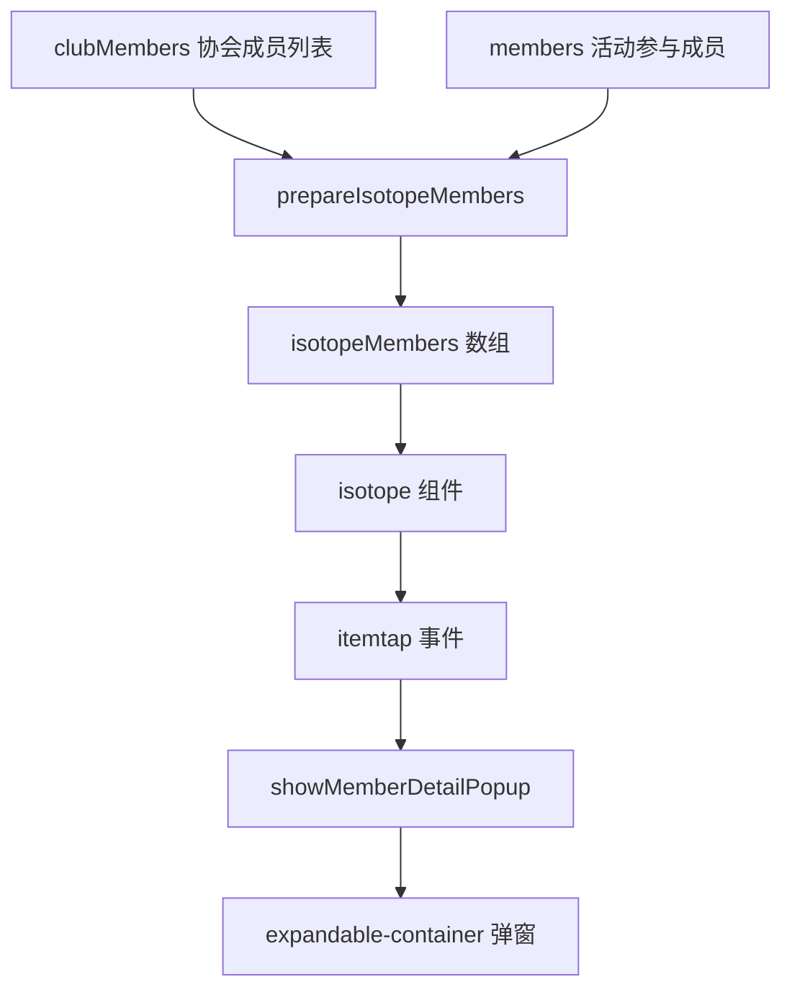

# Design Document: Event Member Isotope

## Overview

本设计文档描述如何将 event-manage-panel 组件中的活动人员弹窗（card-members）内的人员列表改造为 isotope 容器布局。设计参考 club-manage-panel 中人员管理区域的 isotope 实现方式，复用现有的 isotope 组件和 expandable-container 组件。

## Architecture

### 组件关系

```
event-manage-panel
├── expandable-container_fullscreen (card-members)
│   └── isotope (eventMemberIsotope)
│       └── 成员头像项 (带快速操作按钮)
└── expandable-container (共享成员详情弹窗)
    └── 成员详情内容
```

### 数据流



## Components and Interfaces

### 1. Isotope 组件配置

```javascript
// isotope 组件属性配置
{
  id: "eventMemberIsotope",
  items: isotopeMembers,           // 成员数据数组
  layoutMode: "fitRows",           // 网格布局模式
  width: "700rpx",                 // 容器宽度
  height: memberIsoHeight,         // 动态高度
  gutter: 12,                      // 间距
  transitionDuration: "0.3s",      // 过渡动画时长
  backgroundColor: "transparent",   // 透明背景
  imageStyle: { borderRadius: '50%' },  // 圆形头像
  showLabel: true,                 // 显示姓名标签
  labelStyle: { fontSize: '22rpx', color: '#333', textAlign: 'center' },
  labelHeight: 32,                 // 标签高度
  autoHeight: true,                // 自动高度
  sortBy: memberSortBy,            // 排序字段
  sortAscending: memberSortAscending  // 排序方向
}
```

### 2. 成员数据结构

```javascript
// isotopeMembers 数组中每个成员的数据结构
{
  id: `event-member-${user_id}`,   // 唯一标识
  image: avatar,                   // 头像 URL
  ini_width: 72,                   // 头像宽度
  ini_height: 72,                  // 头像高度
  label: user_name,                // 显示的姓名
  user_id: String,                 // 用户 ID
  user_name: String,               // 用户姓名
  phone: String,                   // 联系电话
  department: String,              // 部门
  position: String,                // 职位
  role: String,                    // 角色 (president/vice_president/director/member)
  role_display: String,            // 角色显示名称
  is_joined: Boolean,              // 是否已参加活动
  is_clockin: Boolean,             // 是否已打卡
  status: String,                  // 状态 (clockin/joined/not)
  _sortPriority: Number,           // 排序优先级
  _memberData: Object              // 原始成员数据
}
```

### 3. 排序配置

```javascript
// 排序选项
sortOptions: [
  { value: 'joinedFirst', label: '参与优先' },
  { value: 'roleFirst', label: '角色优先' },
  { value: 'name', label: '姓名排序' }
]

// 排序优先级计算
function getMemberSortPriority(member, sortMode) {
  if (sortMode === 'joinedFirst') {
    return member.is_joined ? 0 : 1;
  }
  if (sortMode === 'roleFirst') {
    const roleMap = { president: 0, vice_president: 1, director: 2, member: 3 };
    return roleMap[member.role] ?? 3;
  }
  return 0; // 姓名排序不使用优先级
}
```

### 4. 事件处理接口

```javascript
// isotope itemtap 事件处理
onMemberItemTap(e) {
  const { item, tapX, tapY } = e.detail;
  this.showMemberDetailPopup(item, tapX, tapY);
}

// 显示成员详情弹窗
showMemberDetailPopup(item, tapX, tapY) {
  this.setData({ currentMember: item._memberData });
  const popup = this.selectComponent('#em-shared-member-detail');
  popup.expand(tapX, tapY);
}

// 快速切换参与状态
toggleMemberJoinFast(e) {
  const { userId, isJoined } = e.currentTarget.dataset;
  if (isJoined) {
    this.removeMemberFromEvent(userId);
  } else {
    this.addMemberToEvent(userId);
  }
}
```

## Data Models

### 状态数据

```javascript
data: {
  // 成员 Isotope 相关
  isotopeMembers: [],              // Isotope 使用的成员数组
  memberIsoHeight: '300rpx',       // Isotope 容器高度
  memberSortMode: 'joinedFirst',   // 当前排序模式
  memberSortBy: ['_sortPriority', 'user_name'],  // 排序字段
  memberSortAscending: [true, true],             // 排序方向
  sortOptions: [
    { value: 'joinedFirst', label: '参与优先' },
    { value: 'roleFirst', label: '角色优先' },
    { value: 'name', label: '姓名排序' }
  ],
  memberLabelStyle: {
    fontSize: '22rpx',
    color: '#333',
    textAlign: 'center'
  },
  memberImageStyle: { borderRadius: '50%' },
  
  // 共享弹窗数据
  currentMember: null,             // 当前选中的成员
  
  // 原有数据保持不变
  members: [],                     // 活动参与成员
  clubMembers: [],                 // 协会成员
  // ...
}
```

## Correctness Properties

*A property is a characteristic or behavior that should hold true across all valid executions of a system-essentially, a formal statement about what the system should do. Properties serve as the bridge between human-readable specifications and machine-verifiable correctness guarantees.*

### Property 1: 自动高度计算正确性

*For any* 成员列表，isotope 容器的高度应该根据成员数量和每行可容纳的成员数正确计算，确保所有成员都能完整显示。

**Validates: Requirements 1.4**

### Property 2: 排序正确性

*For any* 成员列表和排序模式：
- 当选择"参与优先"排序时，所有已参加活动的成员应该排在未参加的成员前面
- 当选择"角色优先"排序时，成员应该按会长 < 副会长 < 理事 < 会员的顺序排列
- 当选择"姓名排序"时，成员应该按姓名的字母顺序排列

**Validates: Requirements 3.2, 3.3, 3.4**

### Property 3: 状态切换正确性

*For any* 成员，点击快速操作按钮后，其参与状态应该正确切换：
- 如果原来是已参加，切换后应该变为未参加
- 如果原来是未参加，切换后应该变为已参加

**Validates: Requirements 4.4**

## Error Handling

### 数据加载失败

```javascript
async loadClubMembers(clubId) {
  try {
    const res = await this.request({ url: `/club/${clubId}/members` });
    if (res.Flag == 4000) {
      // 处理成功
    } else {
      throw new Error(res.message || '获取成员失败');
    }
  } catch (e) {
    console.error(e);
    wx.showToast({ title: '加载成员失败', icon: 'none' });
    this.setData({ isotopeMembers: [] });
  }
}
```

### 状态切换失败

```javascript
async toggleMemberJoin(userId, isJoined) {
  try {
    wx.showLoading({ title: '处理中...' });
    const res = await this.request({
      url: isJoined 
        ? `/event/${eventId}/remove_member/${userId}`
        : `/event/${eventId}/add_member/${userId}`,
      method: 'GET'
    });
    if (res.Flag != 4000) {
      throw new Error(res.message || '操作失败');
    }
    // 更新本地状态
    this.updateMemberJoinStatus(userId, !isJoined);
  } catch (e) {
    wx.showToast({ title: e.message || '操作失败', icon: 'none' });
  } finally {
    wx.hideLoading();
  }
}
```

## Testing Strategy

### 单元测试

1. **prepareIsotopeMembers 函数测试**
   - 测试空成员列表的处理
   - 测试成员状态（is_joined, is_clockin）的正确映射
   - 测试排序优先级的正确计算

2. **排序逻辑测试**
   - 测试"参与优先"排序的正确性
   - 测试"角色优先"排序的正确性
   - 测试"姓名排序"的正确性

3. **状态切换测试**
   - 测试添加成员到活动
   - 测试从活动移除成员
   - 测试状态切换后 UI 更新

### 属性测试

使用 fast-check 库进行属性测试：

1. **高度计算属性测试**
   - 生成随机数量的成员
   - 验证计算的高度能容纳所有成员

2. **排序属性测试**
   - 生成随机成员列表
   - 应用各种排序模式
   - 验证排序后的列表满足排序条件

3. **状态切换属性测试**
   - 生成随机成员状态
   - 执行切换操作
   - 验证状态正确取反
