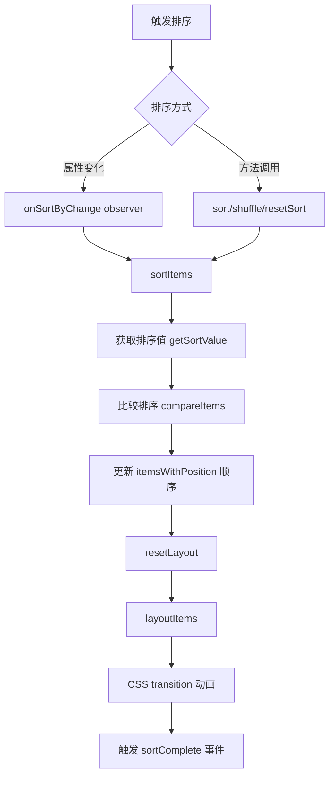

# Design Document: Isotope Sorting Feature

## Overview

为微信小程序版 Isotope 组件添加排序功能，参照原版 Isotope.js 的排序 API 设计，支持按自定义字段排序、多字段排序、自定义排序函数，并利用现有的 CSS transition 机制实现平滑的排序动画效果。

## Architecture

### 排序流程



### 与现有功能的集成

排序功能将与现有的布局系统无缝集成：

1. **排序** → 改变 `itemsWithPosition` 数组顺序
2. **布局** → `layoutItems()` 根据新顺序计算 x/y 坐标
3. **动画** → CSS `transition: all` 自动处理位置变化动画

## Components and Interfaces

### 新增 Properties

```javascript
properties: {
  // 排序字段（单个字段或多字段数组）
  sortBy: {
    type: null, // String | Array<String> | null
    value: null,
    observer: 'onSortByChange'
  },
  // 排序方向（升序/降序，支持单个或数组）
  sortAscending: {
    type: null, // Boolean | Array<Boolean>
    value: true
  },
  // 自定义排序值获取函数
  getSortData: {
    type: Object,
    value: {}
    // 格式: { fieldName: (item) => sortValue }
  }
}
```

### 新增 Data

```javascript
data: {
  // 当前排序状态
  currentSortBy: null,
  currentSortAscending: true,
  // 是否正在排序中（防止重复触发）
  isSorting: false
}
```

### 新增 Methods

```javascript
methods: {
  /**
   * 排序属性变化处理
   */
  onSortByChange(newVal, oldVal) {},
  
  /**
   * 执行排序（核心方法）
   * @param {String|Array} sortBy - 排序字段
   * @param {Boolean|Array} sortAscending - 排序方向
   */
  sortItems(sortBy, sortAscending) {},
  
  /**
   * 获取 item 的排序值
   * @param {Object} item - item 对象
   * @param {String} key - 排序字段名
   * @returns {*} 排序值
   */
  getSortValue(item, key) {},
  
  /**
   * 比较两个 items
   * @param {Object} a - item A
   * @param {Object} b - item B
   * @param {String|Array} sortBy - 排序字段
   * @param {Boolean|Array} sortAscending - 排序方向
   * @returns {Number} 比较结果 (-1, 0, 1)
   */
  compareItems(a, b, sortBy, sortAscending) {},
  
  /**
   * 比较两个值
   * @param {*} valueA - 值 A
   * @param {*} valueB - 值 B
   * @param {Boolean} ascending - 是否升序
   * @returns {Number} 比较结果
   */
  compareValues(valueA, valueB, ascending) {},
  
  /**
   * 对外暴露：排序方法
   */
  sort(sortBy, sortAscending) {},
  
  /**
   * 对外暴露：随机打乱
   */
  shuffle() {},
  
  /**
   * 对外暴露：重置为原始顺序
   */
  resetSort() {}
}
```

### 修改现有方法

```javascript
// loadGroupItems 中添加 originalIndex
loadGroupItems(groupIndex = 0) {
  // ... existing code ...
  const itemsWithPosition = currentGroup.map((item, index) => ({
    ...item,
    index,
    originalIndex: index,  // 新增：保存原始顺序
    // ... rest of properties
  }));
}

// addItem 中添加 originalIndex
addItem(item, options = {}) {
  // ... existing code ...
  const newItem = {
    ...item,
    originalIndex: currentItems.length,  // 新增
    // ... rest of properties
  };
}
```

## Data Models

### Item 对象扩展

```javascript
{
  // 必填字段
  id: String,
  image: String,
  ini_width: Number,
  ini_height: Number,
  
  // 内部字段（组件自动添加）
  index: Number,           // 当前数组索引
  originalIndex: Number,   // 原始顺序索引（新增）
  x: Number,
  y: Number,
  // ... 其他现有字段
  
  // 用户自定义排序字段（示例）
  name: String,
  date: Date | String,
  order: Number,
  category: String,
  // ... 任意自定义字段
}
```

### getSortData 配置示例

```javascript
{
  // 简单字段映射
  name: item => item.name,
  
  // 数值提取
  order: item => parseInt(item.order) || 0,
  
  // 日期处理
  date: item => new Date(item.date).getTime(),
  
  // 复合排序值
  categoryOrder: item => {
    const categoryRank = { 'VIP': 0, 'Normal': 1, 'Guest': 2 };
    return categoryRank[item.category] || 99;
  },
  
  // 随机值（用于 shuffle）
  random: () => Math.random()
}
```

## Correctness Properties

*A property is a characteristic or behavior that should hold true across all valid executions of a system-essentially, a formal statement about what the system should do. Properties serve as the bridge between human-readable specifications and machine-verifiable correctness guarantees.*

### Property 1: Sorting produces correct order by type

*For any* array of items with sortable fields, when sorted by a field, the resulting order SHALL correctly compare values based on their type:
- String fields use locale-aware comparison
- Number fields use numeric comparison (not string comparison)
- Date fields are converted to timestamps for comparison

**Validates: Requirements 1.4, 1.5, 1.6**

### Property 2: Multi-field sorting respects field priority

*For any* array of items sorted by multiple fields `[field1, field2, ...]`, items with equal values in `field1` SHALL be ordered by `field2`, and so on for subsequent fields.

**Validates: Requirements 2.2**

### Property 3: Custom sort functions are applied correctly

*For any* sortBy key that exists in getSortData, the corresponding function SHALL be called with the item object, and its return value SHALL be used for comparison instead of direct field access.

**Validates: Requirements 3.2, 3.3**

### Property 4: Sort triggers layout recalculation

*For any* sort operation (property change or method call), the items' x/y coordinates SHALL be recalculated based on their new order in the array.

**Validates: Requirements 1.3, 5.2**

### Property 5: Original order is preserved and restorable

*For any* sequence of sort operations, calling `resetSort()` or setting `sortBy` to 'original' SHALL restore items to their initial order (by originalIndex).

**Validates: Requirements 6.1, 6.2, 5.4**

### Property 6: Shuffle produces different order

*For any* array with more than one item, calling `shuffle()` SHALL produce an order different from the current sorted order (with high probability for arrays > 2 items).

**Validates: Requirements 5.3**

### Property 7: sortComplete event contains complete payload

*For any* sort operation that completes, the `sortComplete` event SHALL be triggered with detail containing: sortBy value, sortAscending value, and the sorted items array.

**Validates: Requirements 7.1, 7.2, 7.3**

## Error Handling

| 场景 | 处理方式 |
|------|---------|
| sortBy 字段不存在 | 使用 undefined 作为排序值，排到末尾 |
| getSortData 函数抛出异常 | catch 异常，使用 undefined 作为排序值 |
| sortBy 为空数组 | 等同于 null，不执行排序 |
| 排序过程中 items 变化 | 使用 isSorting 标志防止冲突 |
| 非法 sortAscending 值 | 默认使用 true（升序） |

## Testing Strategy

### 单元测试

1. **getSortValue 测试**
   - 直接字段访问
   - getSortData 函数调用
   - 不存在的字段处理

2. **compareValues 测试**
   - 字符串比较（含中文）
   - 数字比较
   - 日期比较
   - null/undefined 处理

3. **compareItems 测试**
   - 单字段排序
   - 多字段排序
   - 混合排序方向

### Property-Based Tests

使用 fast-check 或类似库进行属性测试：

1. **排序稳定性测试**
   - 生成随机 items 数组
   - 执行排序
   - 验证结果符合排序规则

2. **原始顺序恢复测试**
   - 生成随机 items
   - 执行多次排序
   - resetSort 后验证顺序

3. **多字段排序测试**
   - 生成有重复主键的 items
   - 验证次级排序正确

### 集成测试

1. 排序后布局正确性
2. 动画过渡平滑性（手动验证）
3. 与 addItem/removeItem 的兼容性
4. 与分组轮播的兼容性
