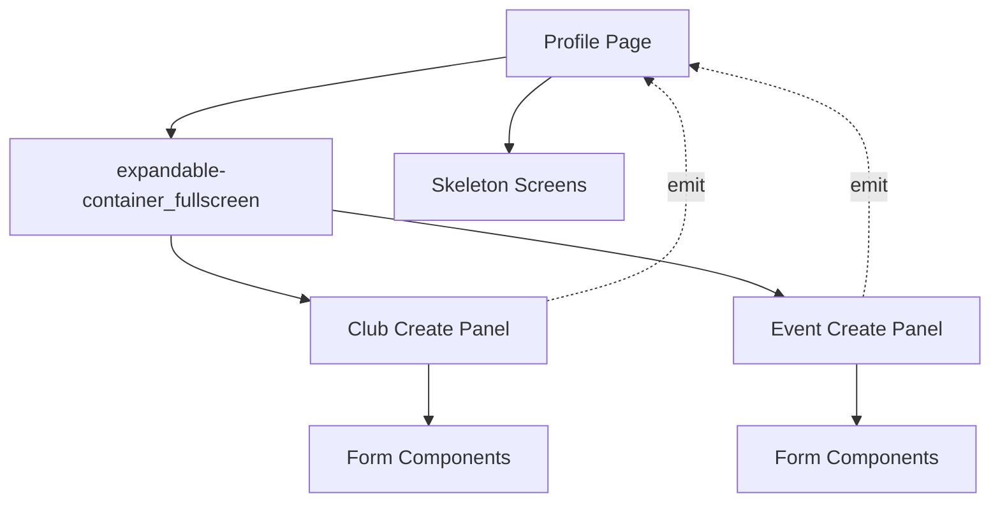

# Design Document: Profile Create Panels

## Overview

本设计文档描述了如何将 profile 页面中的创建协会和创建活动功能从页面跳转改造为全屏弹窗的实现方案。设计参考 home 页面的全屏弹窗实现模式，通过创建可复用的 panel 组件并使用 expandable-container_fullscreen 组件实现流畅的全屏弹窗交互体验。

## Architecture

### 系统架构

```
Profile Page
├── UI Layer
│   ├── User Info Section
│   ├── Statistics Section
│   ├── Function Grid (Create Buttons)
│   └── Fullscreen Popup Container
│       ├── Skeleton Screens
│       ├── Club Create Panel
│       └── Event Create Panel
├── State Management
│   ├── User Data State
│   ├── Statistics State
│   └── Popup State (visible, loading, type, clubId)
└── Event Handlers
    ├── Touch Handlers (record coordinates)
    ├── Popup Control (open, close)
    └── Panel Event Handlers (success, error)
```

### 组件关系图



## Components and Interfaces

### 1. Club Create Panel Component

**位置**: `components/club-components/club-create-panel/`

**职责**: 封装创建协会的所有功能，包括表单输入、验证、提交等。

**接口定义**:

```javascript
// Properties
properties: {
  // 无需额外属性，创建协会不依赖外部参数
}

// Events
events: {
  // 创建成功事件
  'create-success': {
    detail: {
      clubId: String,
      clubData: Object
    }
  },
  // 创建失败事件
  'create-error': {
    detail: {
      error: String
    }
  },
  // 内容加载完成事件
  'loaded': {}
}

// Methods
methods: {
  // 重置表单
  resetForm(): void
  // 提交表单
  submitForm(): Promise<void>
}
```

**数据结构**:

```javascript
data: {
  // 表单数据
  formData: {
    club_name: String,
    description: String,
    cover_url: String,
    // ... 其他字段
  },
  // 表单验证状态
  validation: {
    club_name: Boolean,
    description: Boolean,
    // ... 其他字段
  },
  // 提交状态
  submitting: Boolean
}
```

### 2. Event Create Panel Component

**位置**: `components/event-components/event-create-panel/`

**职责**: 封装创建活动的所有功能，包括表单输入、验证、提交等。

**接口定义**:

```javascript
// Properties
properties: {
  // 协会ID（创建活动时需要指定所属协会）
  clubId: {
    type: String,
    value: ''
  }
}

// Events
events: {
  // 创建成功事件
  'create-success': {
    detail: {
      eventId: String,
      eventData: Object
    }
  },
  // 创建失败事件
  'create-error': {
    detail: {
      error: String
    }
  },
  // 内容加载完成事件
  'loaded': {}
}

// Methods
methods: {
  // 重置表单
  resetForm(): void
  // 提交表单
  submitForm(): Promise<void>
  // 设置协会ID
  setClubId(clubId: String): void
}
```

**数据结构**:

```javascript
data: {
  // 表单数据
  formData: {
    title: String,
    description: String,
    start_time: Date,
    location: String,
    cover_url: String,
    club_id: String,
    // ... 其他字段
  },
  // 表单验证状态
  validation: {
    title: Boolean,
    description: Boolean,
    start_time: Boolean,
    // ... 其他字段
  },
  // 提交状态
  submitting: Boolean
}
```

### 3. Profile Page Popup State

**弹窗状态管理**:

```javascript
data: {
  // 全局弹窗状态
  createPopup: {
    visible: Boolean,      // 弹窗是否可见
    loading: Boolean,      // 是否显示骨架屏
    type: String,          // 'club-create' | 'event-create'
    clubId: String,        // 创建活动时需要的协会ID
    bgColor: String,       // 背景颜色
    sheetBgColor: String,  // 内容区背景颜色
    tapX: Number,          // 触摸起始X坐标
    tapY: Number           // 触摸起始Y坐标
  },
  // 触摸追踪
  touchStartX: Number,
  touchStartY: Number,
  touchStartTime: Number
}
```

### 4. Expandable Container Fullscreen

**使用方式**:

```xml
<expandable-container_fullscreen 
  wx:if="{{createPopup.visible}}"
  id="createFullscreenPopup"
  bg-color="{{createPopup.bgColor}}"
  fullscreen-sheet-bg-color="{{createPopup.sheetBgColor}}"
  fullscreen-top-padding="{{0}}"
  bind:collapse="onCreatePopupCollapse"
  bind:contentReady="onCreatePopupContentReady"
>
  <view slot="trigger"></view>
  <view slot="content" class="popup-content-wrapper">
    <!-- 骨架屏和面板内容 -->
  </view>
</expandable-container_fullscreen>
```

## Data Models

### Popup State Model

```typescript
interface PopupState {
  visible: boolean;        // 弹窗可见性
  loading: boolean;        // 加载状态
  type: 'club-create' | 'event-create' | '';  // 弹窗类型
  clubId: string;          // 协会ID（仅event-create需要）
  bgColor: string;         // 背景颜色
  sheetBgColor: string;    // 内容区背景颜色
  tapX: number;            // 触摸X坐标
  tapY: number;            // 触摸Y坐标
}
```

### Touch Tracking Model

```typescript
interface TouchTracking {
  startX: number;          // 触摸起始X坐标
  startY: number;          // 触摸起始Y坐标
  startTime: number;       // 触摸起始时间戳
}
```

### Panel Event Detail Models

```typescript
// 创建成功事件详情
interface CreateSuccessDetail {
  clubId?: string;         // 协会ID（club-create）
  eventId?: string;        // 活动ID（event-create）
  data: object;            // 创建的数据对象
}

// 创建失败事件详情
interface CreateErrorDetail {
  error: string;           // 错误信息
  code?: string;           // 错误代码
}
```

## Correctness Properties

*属性是一个特征或行为，应该在系统的所有有效执行中保持为真——本质上是关于系统应该做什么的正式声明。属性作为人类可读规范和机器可验证正确性保证之间的桥梁。*

### Property 1: 弹窗状态一致性

*For any* popup open operation, the popup state should transition from {visible: false, loading: true} to {visible: true, loading: true} to {visible: true, loading: false} in sequence.

**Validates: Requirements 5.1, 5.2, 5.3, 5.4**

### Property 2: 触摸坐标记录

*For any* touch event that triggers popup opening, the system should record touch coordinates (tapX, tapY) before opening the popup.

**Validates: Requirements 6.1, 6.2**

### Property 3: 组件通信完整性

*For any* panel component event emission, the parent page should receive and handle the event appropriately.

**Validates: Requirements 7.1, 7.2, 7.3, 7.4, 7.5**

### Property 4: 弹窗类型匹配

*For any* popup open operation, the displayed panel component should match the popup type specified in state.

**Validates: Requirements 3.1, 3.2, 5.2, 5.3**

### Property 5: 参数传递正确性

*For any* event-create popup opening, if clubId is provided, it should be correctly passed to the event-create-panel component.

**Validates: Requirements 2.5, 7.1**

### Property 6: 骨架屏显示逻辑

*For any* popup state where loading is true, the skeleton screen should be displayed; when loading is false, the actual panel content should be displayed.

**Validates: Requirements 8.1, 8.2, 8.3**

### Property 7: 弹窗关闭状态重置

*For any* popup close operation, the popup state should be reset to initial values {visible: false, loading: true, type: '', clubId: ''}.

**Validates: Requirements 5.5, 3.5**

### Property 8: 创建成功后数据刷新

*For any* successful creation event from panel, the profile page should refresh relevant data (managedClubs, statistics).

**Validates: Requirements 4.5, 7.3**

## Error Handling

### 1. 组件加载失败

**场景**: Panel 组件未正确注册或加载失败

**处理策略**:
- 在 profile page 的 onLoad 中验证组件是否正确注册
- 如果组件加载失败，显示错误提示并回退到原有的页面跳转方式
- 记录错误日志以便调试

```javascript
onLoad() {
  try {
    // 验证组件是否存在
    const clubCreatePanel = this.selectComponent('#clubCreatePanel');
    const eventCreatePanel = this.selectComponent('#eventCreatePanel');
    
    if (!clubCreatePanel || !eventCreatePanel) {
      console.error('Panel components not loaded');
      this.setData({ useFallbackNavigation: true });
    }
  } catch (error) {
    console.error('Component verification failed:', error);
    this.setData({ useFallbackNavigation: true });
  }
}
```

### 2. 弹窗打开失败

**场景**: expandable-container_fullscreen 组件无法正常展开

**处理策略**:
- 设置超时检测，如果 contentReady 事件在 5 秒内未触发，显示错误提示
- 提供重试按钮
- 提供回退到页面跳转的选项

```javascript
openCreatePopup(type, clubId = '') {
  this.setData({
    'createPopup.visible': true,
    'createPopup.loading': true,
    'createPopup.type': type,
    'createPopup.clubId': clubId
  });
  
  // 设置超时检测
  this.popupTimeout = setTimeout(() => {
    if (this.data.createPopup.loading) {
      wx.showModal({
        title: '加载超时',
        content: '弹窗加载失败，是否使用页面跳转方式？',
        success: (res) => {
          if (res.confirm) {
            this.closeCreatePopup();
            this.fallbackToPageNavigation(type, clubId);
          }
        }
      });
    }
  }, 5000);
}
```

### 3. 表单提交失败

**场景**: Panel 组件中的表单提交失败

**处理策略**:
- Panel 组件捕获提交错误并通过 create-error 事件通知父组件
- 父组件显示错误提示
- 保持弹窗打开状态，允许用户修改后重试

```javascript
// Panel 组件中
async submitForm() {
  try {
    this.setData({ submitting: true });
    const result = await this.createClub(this.data.formData);
    this.triggerEvent('create-success', { clubId: result.club_id, data: result });
  } catch (error) {
    this.triggerEvent('create-error', { error: error.message });
  } finally {
    this.setData({ submitting: false });
  }
}

// Profile 页面中
onPanelCreateError(e) {
  const { error } = e.detail;
  wx.showToast({
    title: error || '创建失败',
    icon: 'none',
    duration: 2000
  });
}
```

### 4. 触摸事件异常

**场景**: 触摸事件未正确触发或坐标获取失败

**处理策略**:
- 提供默认坐标值（屏幕中心）
- 记录警告日志
- 不影响弹窗正常打开

```javascript
onCreatePopupTouchStart(e) {
  const touch = e.changedTouches && e.changedTouches[0];
  if (touch) {
    this.touchStartX = touch.pageX;
    this.touchStartY = touch.pageY;
    this.touchStartTime = Date.now();
  } else {
    console.warn('Touch event missing coordinates, using defaults');
    // 使用屏幕中心作为默认值
    const systemInfo = wx.getSystemInfoSync();
    this.touchStartX = systemInfo.windowWidth / 2;
    this.touchStartY = systemInfo.windowHeight / 2;
    this.touchStartTime = Date.now();
  }
}
```

### 5. 数据刷新失败

**场景**: 创建成功后刷新 profile 数据失败

**处理策略**:
- 显示创建成功提示
- 记录刷新失败日志
- 提供手动刷新按钮
- 在下次 onShow 时自动重新加载数据

```javascript
async onPanelCreateSuccess(e) {
  const { clubId, eventId, data } = e.detail;
  
  // 关闭弹窗
  this.closeCreatePopup();
  
  // 显示成功提示
  wx.showToast({
    title: '创建成功',
    icon: 'success'
  });
  
  // 尝试刷新数据
  try {
    await this.fetchUserData();
  } catch (error) {
    console.error('Failed to refresh data after creation:', error);
    // 不显示错误提示，因为创建本身已成功
    // 数据会在下次 onShow 时自动刷新
  }
}
```

## Testing Strategy

### 单元测试

**测试范围**:
1. Panel 组件的表单验证逻辑
2. Panel 组件的数据提交逻辑
3. Profile 页面的状态管理逻辑
4. 触摸事件处理逻辑

**测试工具**: 微信小程序测试框架

**示例测试用例**:

```javascript
// 测试 club-create-panel 表单验证
describe('Club Create Panel - Form Validation', () => {
  it('should validate club name is not empty', () => {
    const panel = createComponent('club-create-panel');
    panel.setData({ 'formData.club_name': '' });
    const isValid = panel.validateForm();
    expect(isValid).toBe(false);
  });
  
  it('should validate club name length', () => {
    const panel = createComponent('club-create-panel');
    panel.setData({ 'formData.club_name': 'a'.repeat(51) });
    const isValid = panel.validateForm();
    expect(isValid).toBe(false);
  });
});

// 测试 profile 页面弹窗状态管理
describe('Profile Page - Popup State Management', () => {
  it('should set correct state when opening club create popup', () => {
    const page = createPage('profile');
    page.openCreatePopup('club-create');
    expect(page.data.createPopup.visible).toBe(true);
    expect(page.data.createPopup.type).toBe('club-create');
    expect(page.data.createPopup.loading).toBe(true);
  });
  
  it('should reset state when closing popup', () => {
    const page = createPage('profile');
    page.openCreatePopup('club-create');
    page.closeCreatePopup();
    // 等待动画完成
    setTimeout(() => {
      expect(page.data.createPopup.visible).toBe(false);
      expect(page.data.createPopup.type).toBe('');
    }, 1000);
  });
});
```

### 集成测试

**测试范围**:
1. Profile 页面与 Panel 组件的交互
2. 弹窗打开和关闭的完整流程
3. 创建成功后的数据刷新流程
4. 错误处理流程

**测试场景**:

```javascript
// 测试完整的创建协会流程
describe('Create Club Flow', () => {
  it('should complete full create club flow', async () => {
    const page = createPage('profile');
    
    // 1. 点击创建协会按钮
    page.navigateToCreateClub();
    expect(page.data.createPopup.visible).toBe(true);
    expect(page.data.createPopup.type).toBe('club-create');
    
    // 2. 等待内容加载
    await waitFor(() => page.data.createPopup.loading === false);
    
    // 3. 填写表单
    const panel = page.selectComponent('#clubCreatePanel');
    panel.setData({
      'formData.club_name': 'Test Club',
      'formData.description': 'Test Description'
    });
    
    // 4. 提交表单
    await panel.submitForm();
    
    // 5. 验证成功事件触发
    expect(page.onPanelCreateSuccess).toHaveBeenCalled();
    
    // 6. 验证弹窗关闭
    expect(page.data.createPopup.visible).toBe(false);
    
    // 7. 验证数据刷新
    expect(page.data.managedClubs.length).toBeGreaterThan(0);
  });
});
```

### 属性测试

使用属性测试验证系统的正确性属性。

**测试框架**: 需要集成属性测试库（如 fast-check for JavaScript）

**测试配置**: 每个属性测试运行至少 100 次迭代

**示例属性测试**:

```javascript
// Property 1: 弹窗状态一致性
describe('Property: Popup State Consistency', () => {
  it('should maintain consistent state transitions', () => {
    fc.assert(
      fc.property(
        fc.constantFrom('club-create', 'event-create'),
        fc.string(),
        (type, clubId) => {
          const page = createPage('profile');
          
          // 初始状态
          expect(page.data.createPopup.visible).toBe(false);
          expect(page.data.createPopup.loading).toBe(true);
          
          // 打开弹窗
          page.openCreatePopup(type, clubId);
          expect(page.data.createPopup.visible).toBe(true);
          expect(page.data.createPopup.loading).toBe(true);
          expect(page.data.createPopup.type).toBe(type);
          
          // 内容加载完成
          page.onCreatePopupContentReady();
          expect(page.data.createPopup.visible).toBe(true);
          expect(page.data.createPopup.loading).toBe(false);
          
          return true;
        }
      ),
      { numRuns: 100 }
    );
  });
});

// Property 2: 触摸坐标记录
describe('Property: Touch Coordinates Recording', () => {
  it('should record touch coordinates before opening popup', () => {
    fc.assert(
      fc.property(
        fc.integer({ min: 0, max: 750 }),
        fc.integer({ min: 0, max: 1334 }),
        (x, y) => {
          const page = createPage('profile');
          
          // 模拟触摸事件
          const touchEvent = {
            changedTouches: [{
              pageX: x,
              pageY: y
            }]
          };
          
          page.onCreatePopupTouchStart(touchEvent);
          expect(page.touchStartX).toBe(x);
          expect(page.touchStartY).toBe(y);
          
          page.openCreatePopup('club-create');
          expect(page.data.createPopup.tapX).toBe(x);
          expect(page.data.createPopup.tapY).toBe(y);
          
          return true;
        }
      ),
      { numRuns: 100 }
    );
  });
});

// Property 5: 参数传递正确性
describe('Property: Parameter Passing Correctness', () => {
  it('should correctly pass clubId to event-create-panel', () => {
    fc.assert(
      fc.property(
        fc.string({ minLength: 1, maxLength: 50 }),
        (clubId) => {
          const page = createPage('profile');
          
          // 打开创建活动弹窗
          page.openCreatePopup('event-create', clubId);
          
          // 等待内容加载
          page.onCreatePopupContentReady();
          
          // 获取 panel 组件
          const panel = page.selectComponent('#eventCreatePanel');
          
          // 验证 clubId 正确传递
          expect(panel.data.clubId).toBe(clubId);
          
          return true;
        }
      ),
      { numRuns: 100 }
    );
  });
});
```

### 手动测试

**测试场景**:
1. 视觉效果测试：验证弹窗动画流畅性
2. 交互测试：验证触摸反馈和手势操作
3. 兼容性测试：在不同设备和系统版本上测试
4. 性能测试：验证弹窗打开和关闭的性能

**测试设备**:
- iOS 设备（iPhone 12, iPhone 14 Pro）
- Android 设备（小米、华为、OPPO）
- 不同屏幕尺寸（小屏、大屏、刘海屏）

## Implementation Notes

### 1. 组件复制策略

从原有页面复制内容到 panel 组件时需要注意：

- 保持所有业务逻辑不变
- 调整样式以适应弹窗环境
- 添加 loaded 事件触发
- 添加 create-success 和 create-error 事件触发
- 移除页面级别的生命周期函数（如 onLoad, onShow）

### 2. 样式适配

Panel 组件的样式需要考虑：

- 移除页面级别的 padding-top（导航栏高度）
- 确保内容区域有适当的 padding
- 适配安全区域（safe-area-inset）
- 确保滚动容器正确工作

### 3. 性能优化

- 使用 wx:if 而不是 hidden 来控制 panel 显示，避免不必要的渲染
- 骨架屏使用简化的结构，减少渲染开销
- 弹窗关闭时延迟重置状态，等待动画完成
- 避免在弹窗打开时进行大量数据请求

### 4. 动画时序

参考 home 页面的实现：

- 弹窗展开动画：约 300ms
- 内容滑入动画：约 360ms
- 总展开时间：约 700ms
- 关闭动画：约 800ms（包含延迟）

### 5. 向后兼容

保留原有的页面跳转代码作为 fallback：

```javascript
data: {
  useFallbackNavigation: false
},

navigateToCreateClub() {
  if (this.data.useFallbackNavigation) {
    // 使用原有的页面跳转方式
    navigation.navigateToCreate('/packageClub/club-create/index');
  } else {
    // 使用新的弹窗方式
    this.openCreatePopup('club-create');
  }
}
```
